# Oracle Docker & Kubernetes  training 

## Some extra topics to cover 

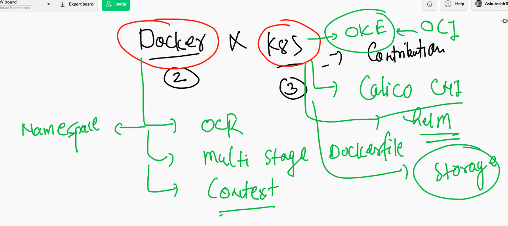

## application deployment model 

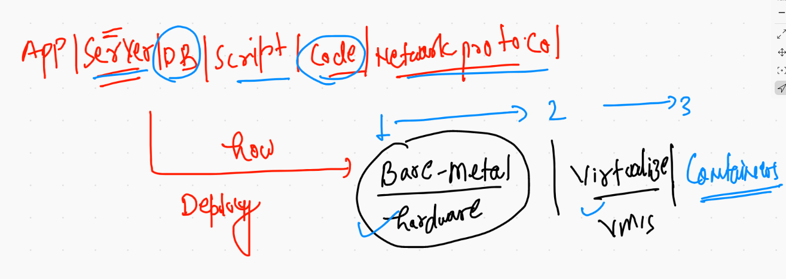

## Containers in reality 

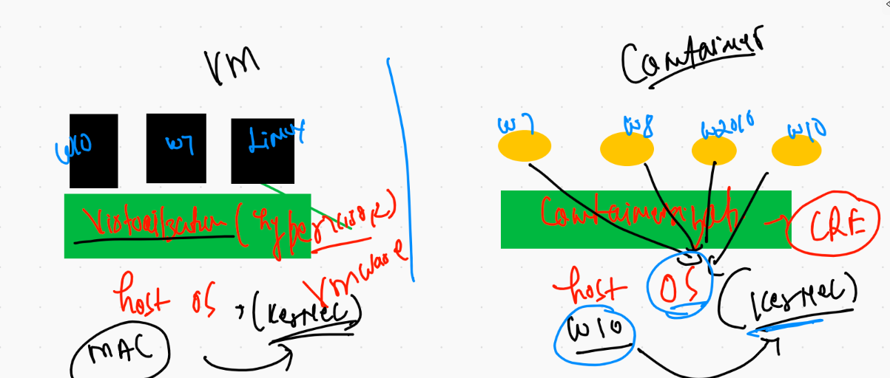

## Container run time engine 


## Docker ce with linux host 

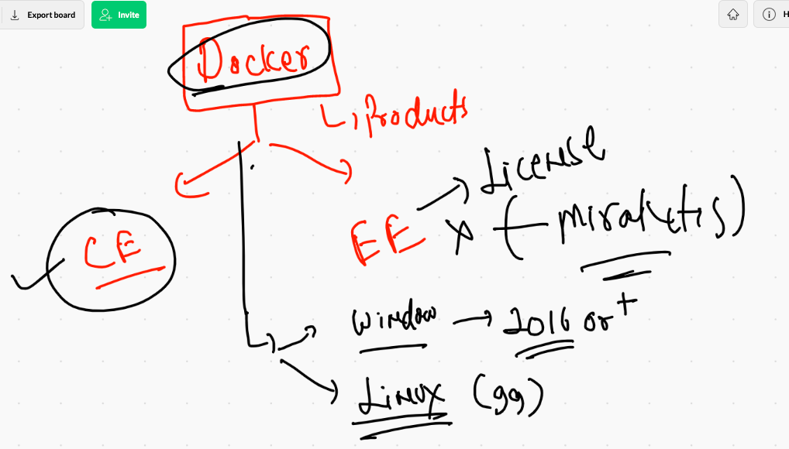

## Docker ce installation 

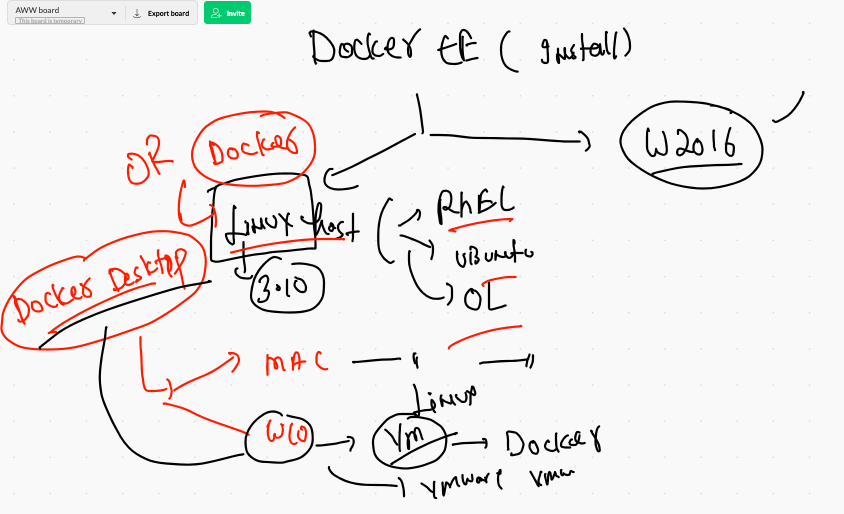

## Docker desktop for windows 10 

[docker desktop for windows 10](https://hub.docker.com/editions/community/docker-ce-desktop-windows/)

[docker desktop for mac](https://hub.docker.com/editions/community/docker-ce-desktop-mac/)

## Docker install on OL / any linux VM 

[docker for linux](https://docs.docker.com/engine/install/centos/)

## Done with installation using linux vm 

```
 14  yum  install  docker  
   15  systemctl enable  --now docker 
   16  systemctl status  docker
   
```

## Docker architecture 

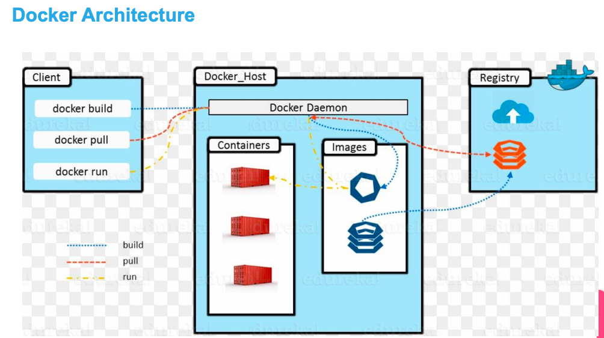

## client to host 

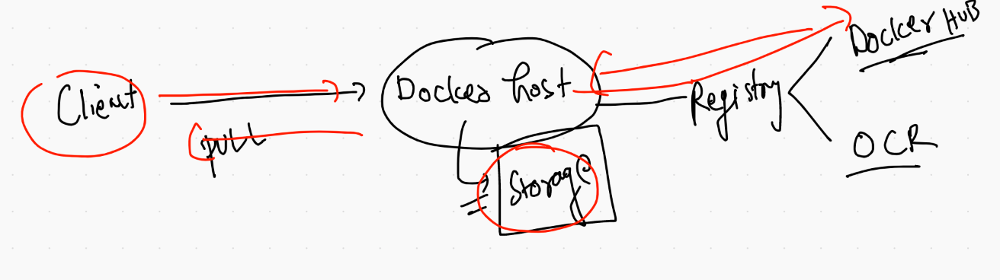

## Docker images operations 

```
❯ docker  images
REPOSITORY    TAG       IMAGE ID       CREATED       SIZE
oraclelinux   8.3       d8ccb1b24024   3 weeks ago   223MB
java          latest    d23bdf5b1b1b   4 years ago   643MB
❯ docker  pull alpine
Using default tag: latest
latest: Pulling from library/alpine
ba3557a56b15: Pull complete 
Digest: sha256:a75afd8b57e7f34e4dad8d65e2c7ba2e1975c795ce1ee22fa34f8cf46f96a3be
Status: Downloaded newer image for alpine:latest
docker.io/library/alpine:latest
❯ docker  pull  busybox
Using default tag: latest
latest: Pulling from library/busybox
5c4213be9af9: Pull complete 
rDigest: sha256:c6b45a95f932202dbb27c31333c4789f45184a744060f6e569cc9d2bf1b9ad6f
Status: Downloaded newer image for busybox:latest
docker.io/library/busybox:latest
❯ docker  images
REPOSITORY    TAG       IMAGE ID       CREATED       SIZE
busybox       latest    491198851f0c   10 days ago   1.23MB
alpine        latest    28f6e2705743   11 days ago   5.61MB
oraclelinux   8.3       d8ccb1b24024   3 weeks ago   223MB
java          latest    d23bdf5b1b1b   4 years ago   643MB


```

## image to container 


## how to create container 

```
❯ docker  run   --name ashuc1        busybox  ping 127.0.0.1
PING 127.0.0.1 (127.0.0.1): 56 data bytes
64 bytes from 127.0.0.1: seq=0 ttl=64 time=1.550 ms
64 bytes from 127.0.0.1: seq=1 ttl=64 time=0.102 ms
64 bytes from 127.0.0.1: seq=2 ttl=64 time=0.123 ms
64 bytes from 127.0.0.1: seq=3 ttl=64 time=0.101 ms
64 bytes from 127.0.0.1: seq=4 ttl=64 time=0.090 ms
64 bytes from 127.0.0.1: seq=5 ttl=64 time=0.415 ms
64 bytes from 127.0.0.1: seq=6 ttl=64 time=0.071 ms
64 bytes from 127.0.0.1: seq=7 ttl=64 time=0.070 m

```

## checking list of running containers 

```
❯ docker  ps
CONTAINER ID   IMAGE     COMMAND            CREATED              STATUS          PORTS     NAMES
d6a442f47167   busybox   "ping 127.0.0.1"   About a minute ago   Up 59 seconds             ashuc1
```


## container with any state 

```
❯ docker  ps -a
CONTAINER ID   IMAGE     COMMAND            CREATED         STATUS                          PORTS     NAMES
d6a442f47167   busybox   "ping 127.0.0.1"   2 minutes ago   Exited (0) About a minute ago             ashuc1

```

## starting a stopped container 

```
❯ docker start  d6a442f47167
d6a442f47167
❯ docker  ps
CONTAINER ID   IMAGE     COMMAND            CREATED         STATUS         PORTS     NAMES
d6a442f47167   busybox   "ping 127.0.0.1"   4 minutes ago   Up 5 seconds             ashuc1

```

## Best practise to create a container 

```
 docker  run  --name ashuc2  -d  -it   alpine  ping 8.8.8.8
1494915ef9c0b7f8fd68a95b0975c19e3953a23947fc5ad52ad8108438b3d01b
❯ docker  ps
CONTAINER ID   IMAGE     COMMAND            CREATED          STATUS          PORTS     NAMES
1494915ef9c0   alpine    "ping 8.8.8.8"     20 seconds ago   Up 18 seconds             ashuc2
d6a442f47167   busybox   "ping 127.0.0.1"   8 minutes ago    Up 4 minutes              ashuc1

```

## a way to conainer management 

```
❯ docker  run  --name ashuc2  -d  -it   alpine  ping 8.8.8.8
1494915ef9c0b7f8fd68a95b0975c19e3953a23947fc5ad52ad8108438b3d01b
❯ docker  ps
CONTAINER ID   IMAGE     COMMAND            CREATED          STATUS          PORTS     NAMES
1494915ef9c0   alpine    "ping 8.8.8.8"     20 seconds ago   Up 18 seconds             ashuc2
d6a442f47167   busybox   "ping 127.0.0.1"   8 minutes ago    Up 4 minutes              ashuc1
❯ 
❯ docker  stop   ashuc2
ashuc2
❯ docker  ps
CONTAINER ID   IMAGE     COMMAND            CREATED          STATUS         PORTS     NAMES
d6a442f47167   busybox   "ping 127.0.0.1"   11 minutes ago   Up 7 minutes             ashuc1
❯ docker  ps -a
CONTAINER ID   IMAGE     COMMAND            CREATED          STATUS                       PORTS     NAMES
1494915ef9c0   alpine    "ping 8.8.8.8"     3 minutes ago    Exited (137) 6 seconds ago             ashuc2
5d127df5e178   busybox   "cal"              6 minutes ago    Exited (0) 6 minutes ago               x1
d6a442f47167   busybox   "ping 127.0.0.1"   11 minutes ago   Up 7 minutes                           ashuc1
❯ docker  start   ashuc2
ashuc2
❯ docker  ps -a
CONTAINER ID   IMAGE     COMMAND            CREATED          STATUS                     PORTS     NAMES
1494915ef9c0   alpine    "ping 8.8.8.8"     3 minutes ago    Up 9 seconds                         ashuc2
5d127df5e178   busybox   "cal"              6 minutes ago    Exited (0) 6 minutes ago             x1
d6a442f47167   busybox   "ping 127.0.0.1"   11 minutes ago   Up 7 minutes                         ashuc1
❯ docker  kill  ashuc2
ashuc2
❯ docker  start  ashuc2
ashuc2
❯ docker  ps
CONTAINER ID   IMAGE     COMMAND            CREATED          STATUS          PORTS     NAMES
1494915ef9c0   alpine    "ping 8.8.8.8"     4 minutes ago    Up 11 seconds             ashuc2
d6a442f47167   busybox   "ping 127.0.0.1"   13 minutes ago   Up 9 minutes              ashuc1
❯ docker  ps -a
CONTAINER ID   IMAGE     COMMAND            CREATED          STATUS                     PORTS     NAMES
1494915ef9c0   alpine    "ping 8.8.8.8"     5 minutes ago    Up 15 seconds                        ashuc2
5d127df5e178   busybox   "cal"              8 minutes ago    Exited (0) 8 minutes ago             x1
d6a442f47167   busybox   "ping 127.0.0.1"   13 minutes ago   Up 9 minutes                         ashuc1
❯ docker  rm  x1
x1
❯ docker  ps
CONTAINER ID   IMAGE     COMMAND            CREATED          STATUS          PORTS     NAMES
1494915ef9c0   alpine    "ping 8.8.8.8"     5 minutes ago    Up 25 seconds             ashuc2
d6a442f47167   busybox   "ping 127.0.0.1"   13 minutes ago   Up 9 minutes              ashuc1

```

## checking logs / output of process running inside container 

```
8915  docker  logs  ashuc1
 8916  docker  logs  ashuc1  -f
 
```

## Containerization process


## Builder tools to build docker images

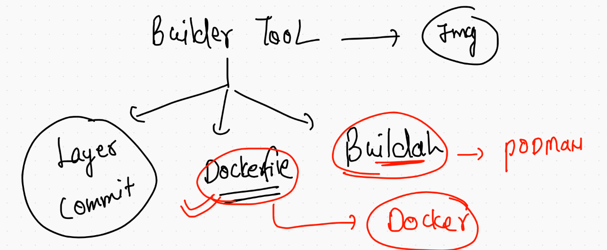

## Vscode link 

[vscode](https://code.visualstudio.com/download)


### Dockerfile example 1 

```
❯ docker  build  -t  ashuscript:v1  /Users/fire/Desktop/myimages/shellscript
Sending build context to Docker daemon  3.584kB
Step 1/5 : FROM oraclelinux:8.3
 ---> d8ccb1b24024
Step 2/5 : MAINTAINER  ashutoshh@linux.com
 ---> Running in eb2b0cea962e
Removing intermediate container eb2b0cea962e
 ---> 348f613a9df9
Step 3/5 : RUN mkdir /mydata
 ---> Running in 32e6f0ef5e3f
Removing intermediate container 32e6f0ef5e3f
 ---> beac19996ce6
Step 4/5 : COPY oracle.sh  /mydata/oracle.sh
 ---> 048d52849e0a
Step 5/5 : CMD  ["bash","/mydata/oracle.sh"]
 ---> Running in dec081d8ae18
Removing intermediate container dec081d8ae18
 ---> 40f34bec24ad
Successfully built 40f34bec24ad
Successfully tagged ashuscript:v1
❯ docker images
REPOSITORY    TAG       IMAGE ID       CREATED         SIZE
ashuscript    v1        40f34bec24ad   8 seconds ago   223MB
busybox       latest    491198851f0c   10 days ago     1.23MB
alpine        latest    28f6e2705743   11 days ago     5.61MB

```

## from currnet location 

```
❯ docker  build  -t  ashuscript:v2  .
Sending build context to Docker daemon  3.584kB
Step 1/5 : FROM oraclelinux:8.3
 ---> d8ccb1b24024
Step 2/5 : MAINTAINER  ashutoshh@linux.com
 ---> Using cache
 ---> 348f613a9df9
Step 3/5 : RUN mkdir /mydata
 ---> Using cache
 ---> beac19996ce6
Step 4/5 : COPY oracle.sh  /mydata/oracle.sh
 ---> Using cache
 ---> 048d52849e0a
Step 5/5 : CMD  ["bash","/mydata/oracle.sh"]
 ---> Using cache
 ---> 40f34bec24ad
Successfully built 40f34bec24ad
Successfully tagged ashuscript:v2


```

## launching container from custom image

```
❯ docker  run --name ashuc3  -d -it  ashuscript:v1
69edb55b6c982e699bd239b246d99de8a3547801149e443672ca1fd45099d7a1
❯ docker  ps
CONTAINER ID   IMAGE           COMMAND                  CREATED          STATUS          PORTS     NAMES
69edb55b6c98   ashuscript:v1   "bash /mydata/oracle…"   3 seconds ago    Up 2 seconds              ashuc3
1494915ef9c0   alpine          "ping 8.8.8.8"           43 minutes ago   Up 38 minutes             ashuc2
d6a442f47167   busybox         "ping 127.0.0.1"         52 minutes ago   Up 48 minutes             ashuc1
❯ docker logs  -f  ashuc3
HEllo world
time is  Mon Mar  1 07:22:10 UTC 2021
THis is container process ...
HEllo world
time is  Mon Mar  1 07:22:17 UTC 2021
THis is container process ...
HEllo world
time is  Mon Mar  1 07:22:24 UTC 2021
THis is container process ...
HEllo world
time is  Mon Mar  1 07:22:31 UTC 2021
THis is container process ...
HEllo world
time is  Mon Mar  1 07:22:38 UTC 2021
THis is container process ...
HEllo world

```


## Kill and remove  all the containers 

```
❯ docker  ps -q
69edb55b6c98
1494915ef9c0
d6a442f47167
❯ docker kill $(docker  ps -q)
69edb55b6c98
1494915ef9c0
d6a442f47167
❯ docker rm  $(docker  ps -aq)
69edb55b6c98
1494915ef9c0
d6a442f47167

```


## using entrypoint and cmd all together 

```
 8956  docker build -t  ashuscript:v4  . 
 8957  docker run  -d  --name x2  -it  ashuscript:v4  
 8958  docker run  -d  --name x3  -it  ashuscript:v4  
 8959  docker  ps
 8960  docker run  -d  --name x5  -it  ashuscript:v4  /mydata/hello.sh 
 8961  docker  ps
❯ docker ps
CONTAINER ID   IMAGE           COMMAND                  CREATED              STATUS              PORTS     NAMES
21e00ba0357a   ashuscript:v4   "/bin/bash /mydata/h…"   About a minute ago   Up About a minute             x5
71f4f1d731e1   ashuscript:v4   "/bin/bash /mydata/o…"   About a minute ago   Up About a minute             x3
cb31aed77092   ashuscript:v3   "bash /mydata/oracle…"   9 minutes ago        Up 9 minutes                  x2
dc42ec9890d5   ashuscript:v1   "ping 127.0.0.1"         11 minutes ago       Up 11 minutes                 x1

```


## access shell of a running container 

```
❯ docker exec -it  x5  bash
[root@21e00ba0357a /]# 
[root@21e00ba0357a /]# 
[root@21e00ba0357a /]# cd /mydata/
[root@21e00ba0357a mydata]# ls
hello.sh  oracle.sh
[root@21e00ba0357a mydata]# cat  /etc/os-release 
NAME="Oracle Linux Server"
VERSION="8.3"
ID="ol"
ID_LIKE="fedora"
VARIANT="Server"
VARIANT_ID="server"
VERSION_ID="8.3"
PLATFORM_ID="platform:el8"
PRETTY_NAME="Oracle Linux Server 8.3"
ANSI_COLOR="0;31"
CPE_NAME="cpe:/o:oracle:linux:8:3:server"
HOME_URL="https://linux.oracle.com/"
BUG_REPORT_URL="https://bugzilla.oracle.com/"

ORACLE_BUGZILLA_PRODUCT="Oracle Linux 8"
ORACLE_BUGZILLA_PRODUCT_VERSION=8.3
ORACLE_SUPPORT_PRODUCT="Oracle Linux"
ORACLE_SUPPORT_PRODUCT_VERSION=8.3
[root@21e00ba0357a mydata]# ping 127.0.0.1 


```

## Cgroups for container memory usage limit 

```
❯ docker  run -itd  --name ashux6  --memory 10m ashuscript:v4
f6ee3d3df901f7a4a8c5104a1d7b7bbcaf916bb7a64f11c6c0d0330ed5c66dec
```


## ram with cpu 

```
❯ docker  run -itd  --name ashux7  --memory 10m --cpu-shares=30 ashuscript:v4
c2599b963822a9415ec82f8b1da4fbc26100fa5c40c0565b2778a850acff2706

```

## more cgroups examples

```
8974  docker  run -itd  --name x6  --memory 10m ashuscript:v4  
 8975  docker  run -itd  --name ashux6  --memory 10m ashuscript:v4  
 8976* docker  stats  
 8977  docker  run -itd  --name ashux7  --memory 10m --cpu-shares=30 ashuscript:v4  
 8978  history
 8979  docker  ps
 8980  docker update  x1  --memory 200m 
 8981  docker update --help
 8982  docker update  x1  --memory-swap 200m 


```

## python

```
❯ docker  build  -t  ashupy:v1 -f  python.dockerfile    .
Sending build context to Docker daemon  3.072kB
Step 1/5 : FROM python
latest: Pulling from library/python
0ecb575e629c: Pull complete 
7467d1831b69: Pull complete 
feab2c490a3c: Pull complete 
f15a0f46f8c3: Pull complete 
937782447ff6: Pull complete 
e78b7aaaab2c: Pull complete 
b68a1c52a41c: Pull complete 
ddcd772f47ec: Pull complete 
aef84dafa567: Pull complete 
Digest: sha256:e2cd43d291bbd21bed01bcceb5c0a8d8c50a9cef319a7b5c5ff6f85232e82021
Status: Downloaded newer image for python:latest
 ---> 254d4a8a8f31
Step 2/5 : MAINTAINER ashutoshh@linux.com
 ---> Running in 0db495d87063
Removing intermediate container 0db495d87063
 ---> b75d80e18e31
Step 3/5 : RUN mkdir /code
 ---> Running in 387a6f91c664
Removing intermediate container 387a6f91c664
 ---> 7cf4a846945e
Step 4/5 : COPY abc.py /code/abc.py
 ---> 7f3a9e41aa3a
Step 5/5 : ENTRYPOINT ["python","/code/abc.py"]
 ---> Running in d64bbfd68314
Removing intermediate container d64bbfd68314
 ---> a9e4907a9b81
Successfully built a9e4907a9b81
Successfully tagged ashupy:v1

```

## creating container from this image

```
docker  run -itd --name ashupc1  ashupy:v1 
 8999  docker  ps
 9000  docker logs -f  ashupc1  

```

## Docker task 1 

```
Q1.   create  two containers and do the given things 

Image must be alpine 
Name of container <yourname>c1 & <yourname>c2
Parent process you can choose accordingly 
Create two files in container1 named aa.txt & bb.txt 
Now copy aa.txt into second container

```

## Image sharing 

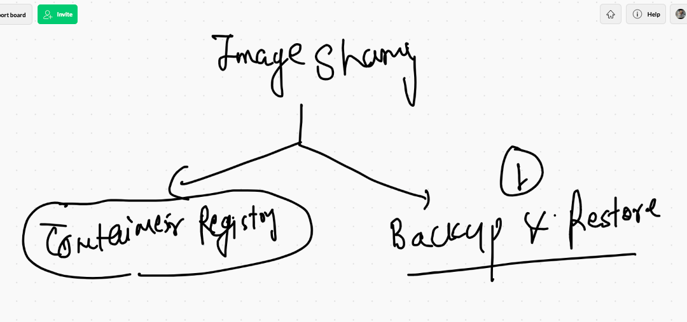

## saving image into tar file 

```
❯ docker  save  -o  myimg.tar   ashupy:v4
❯ ls
abc.py            myimg.tar         python.dockerfile

```

## removing image

```
 docker rmi  ashupy:v4
Untagged: ashupy:v4
Deleted: sha256:b692df35b0e37dbb12343e8be4655e692c9ea14ad37852733bf6f04bb04bea65
Deleted: sha256:d6f8acc6f59e229d7754b1dfda321f778c3844c47492dafbe92ea5fd6f490244
Deleted: sha256:133dd0effa21ca188709f16f32ae5e53dd68ade3a18029babeeb844188833b39
Deleted: sha256:3455e5d51f0901da87edbdb2b5781faaf1360123453b9be9bd9c658638b873d5
Deleted: sha256:a64117a8b724a6e4e5d47cc75a0eaf11c2d14c602b6fd486644d526753628a1e
Deleted: sha256:c362e83d5e38a66ee84ecb7ba1f2c667a421c988cbc04b0188a3e141934b418f
Deleted: sha256:a98e91c7be5758ddcd90f2c990dffe5553cbbee62e2493e39b9f2029a416c01e
Deleted: sha256:fd47fa3a1644d8130d1ea1a30827071333cc8a087503fd5e40716880a846bcdf

```

## when you got .tar file of any image then you can restore it 


```
❯ ls
abc.py            myimg.tar         python.dockerfile
❯ docker load -i  myimg.tar
a74b7c1eb75c: Loading layer [==================================================>]  47.66MB/47.66MB
aa5fc7495324: Loading layer [==================================================>]  2.048kB/2.048kB
528a04bef267: Loading layer [==================================================>]   2.56kB/2.56kB
Loaded image: ashupy:v4
❯ docker  images
REPOSITORY    TAG       IMAGE ID       CREATED             SIZE
ashupy        v4        b692df35b0e3   29 minutes ago      51.2MB

```

## accessing imagedb Metadata if you have linux machine access where docker engine is running 

```
[root@ip-172-31-79-103 ~]# docker  images
REPOSITORY          TAG                 IMAGE ID            CREATED             SIZE
alpine              latest              28f6e2705743        11 days ago         5.61MB
[root@ip-172-31-79-103 ~]# 
[root@ip-172-31-79-103 ~]# 
[root@ip-172-31-79-103 ~]# cd  /var/lib/docker/
[root@ip-172-31-79-103 docker]# ls
builder  buildkit  containers  image  network  overlay2  plugins  runtimes  swarm  tmp  trust  volumes
[root@ip-172-31-79-103 docker]# cd  image/
[root@ip-172-31-79-103 image]# ls
overlay2
[root@ip-172-31-79-103 image]# cd  overlay2/
[root@ip-172-31-79-103 overlay2]# ls
distribution  imagedb  layerdb  repositories.json
[root@ip-172-31-79-103 overlay2]# cd  imagedb/
[root@ip-172-31-79-103 imagedb]# ls
content  metadata
[root@ip-172-31-79-103 imagedb]# cd content/
[root@ip-172-31-79-103 content]# ls
sha256
[root@ip-172-31-79-103 content]# cd  sha256/
[root@ip-172-31-79-103 sha256]# ls
28f6e27057430ed2a40dbdd50d2736a3f0a295924016e294938110eeb8439818
[root@ip-172-31-79-103 sha256]# docker  images
REPOSITORY          TAG                 IMAGE ID            CREATED             SIZE
alpine              latest              28f6e2705743        11 days ago         5.61MB

```

## container registry options 

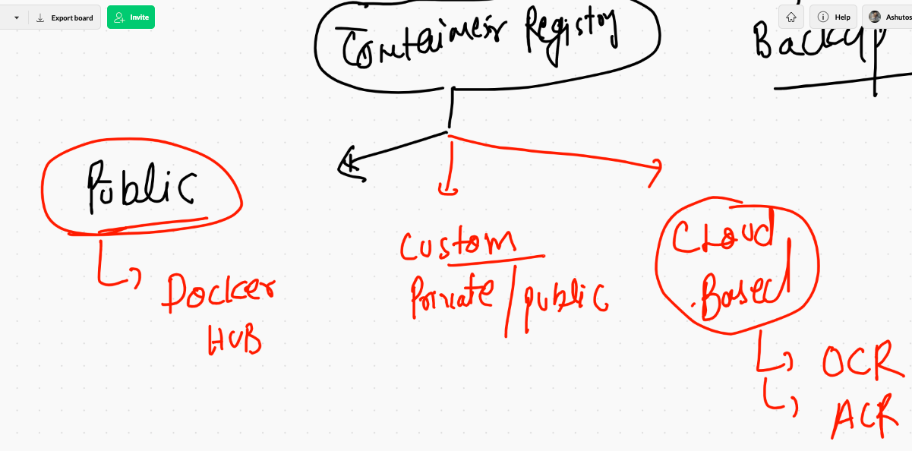

## PUshing image to docker hub 

```
❯ docker  login  -u  dockerashu
Password: 
Login Succeeded
❯ docker  tag   ashupy:v4    dockerashu/ashupy:v4
❯ docker  push  dockerashu/ashupy:v4
The push refers to repository [docker.io/dockerashu/ashupy]
528a04bef267: Pushed 
aa5fc7495324: Pushed 
a74b7c1eb75c: Pushed 
cb381a32b229: Mounted from library/alpine 
v4: digest: sha256:ae7b1f1ed9f942ccee57af2e3989f77e29f1a202f987f63a0e4ee87723e27a89 size: 1154

```

## you can logout your docker hub cred 

```
❯ docker  logout
Removing login credentials for https://index.docker.io/v1/

```

## image name reality 

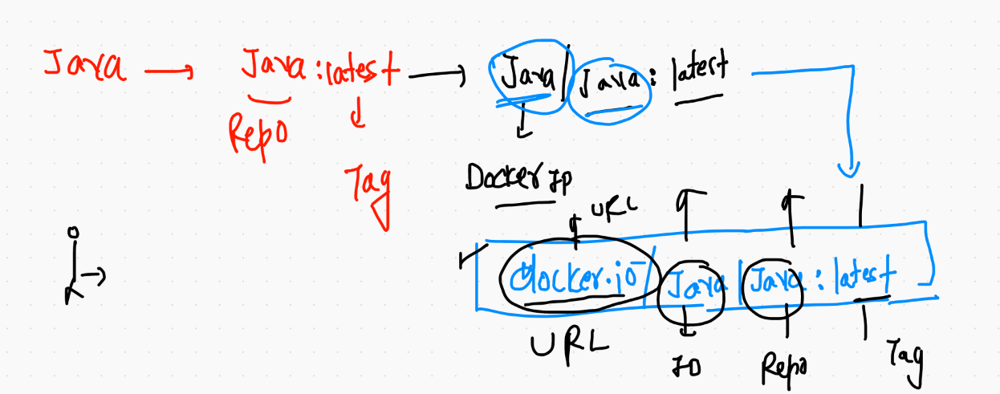


