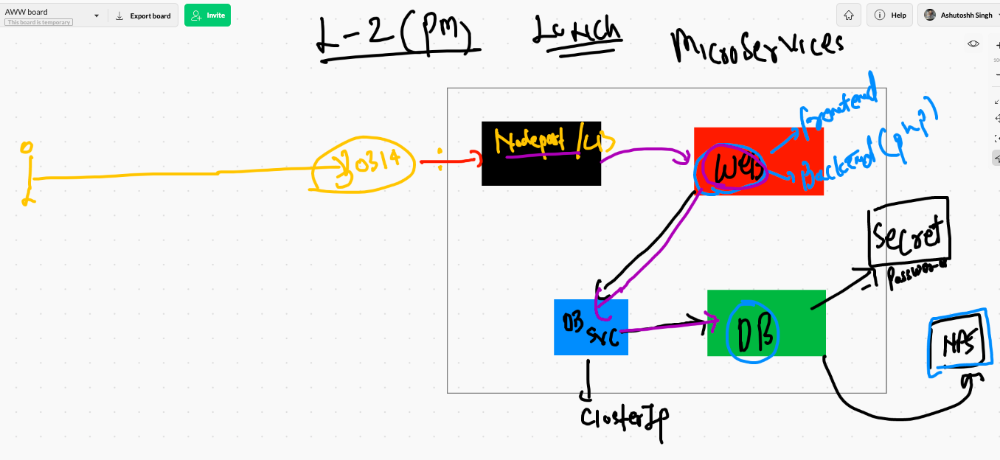
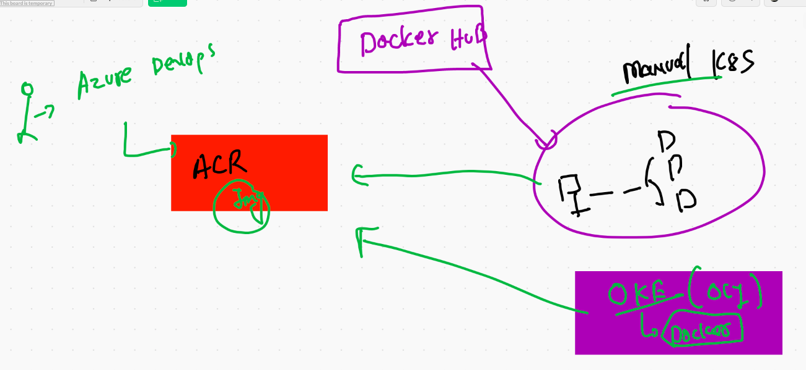
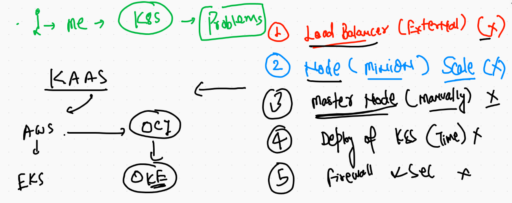
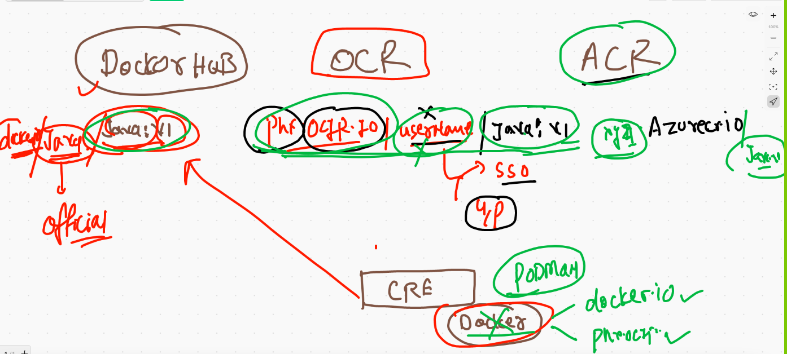
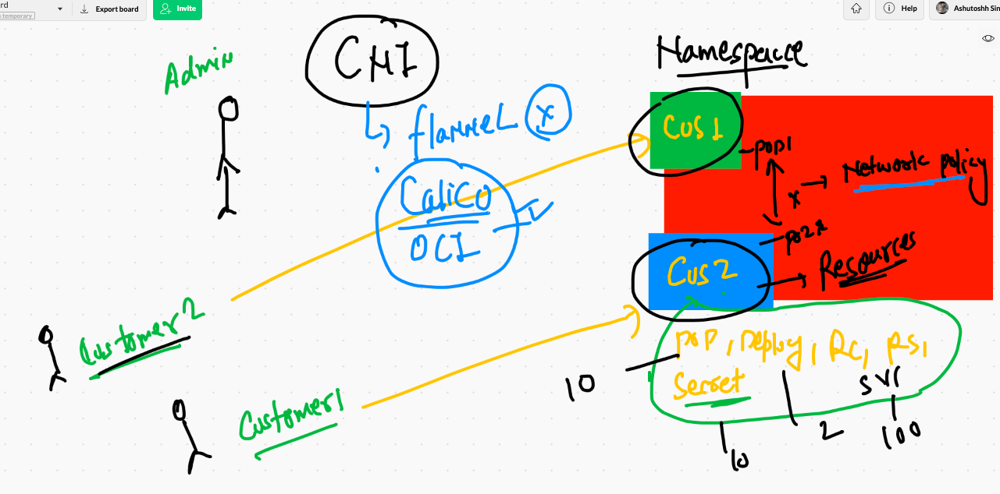
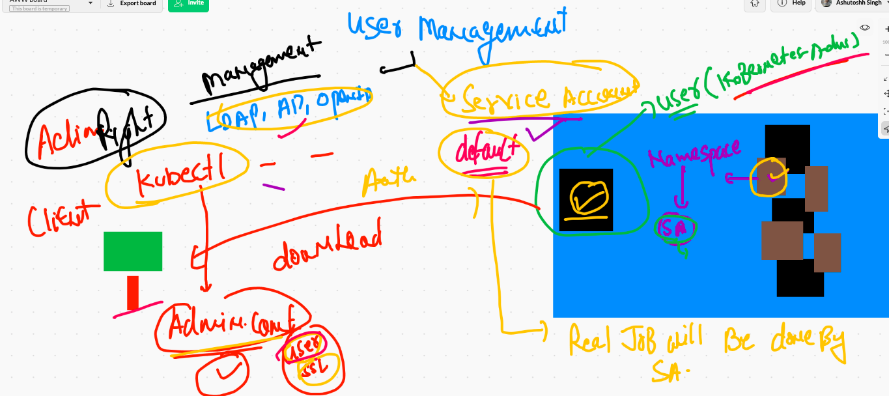
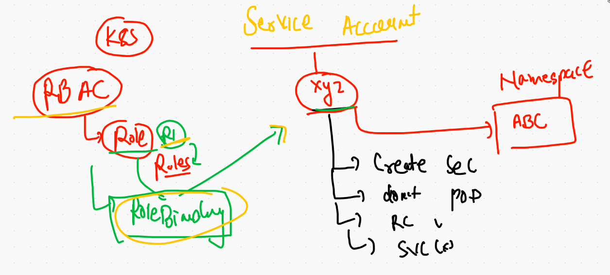

# K8s volume 

## EmptyDir TYpe 

```
❯ ls
alp.yml       ashupod2.yaml deploy.yml    helloapp.yaml service.yml
ashupod1.yaml ashuwebapp    empvol.yml    p.json        web.yaml
❯ kubectl  apply -f   empvol.yml
pod/podx1 created
❯ kubectl  get   po
NAME    READY   STATUS    RESTARTS   AGE
podx1   2/2     Running   0          7s
❯ kubectl  exec -it  podx1 -c  ashuc1 -- /bin/sh
/ # 
/ # cd /mnt/data/
/mnt/data # ls
a.txt
/mnt/data # exit
❯ kubectl  exec -it  podx1 -c  ashuc2 -- /bin/bash
root@podx1:/# 
root@podx1:/# 
root@podx1:/# 
root@podx1:/# cd  /usr/share/nginx/html/
root@podx1:/usr/share/nginx/html# ls
a.txt
root@podx1:/usr/share/nginx/html# 


```

## Hostpath volume 


## portainer deployment 

```
❯ kubectl apply -f  portainer.yml
deployment.apps/helloportainer created
❯ kubectl get deploy
NAME             READY   UP-TO-DATE   AVAILABLE   AGE
helloportainer   1/1     1            1           7s
❯ kubectl  expose deploy  helloportainer  --type NodePort --port 1234 --target-port 9000
service/helloportainer exposed
❯ 
❯ kubectl get svc
NAME             TYPE       CLUSTER-IP     EXTERNAL-IP   PORT(S)          AGE
helloportainer   NodePort   10.98.47.125   <none>        1234:31723/TCP   7s

```

## MYsql DB 

```
kubectl  create  deployment   ashudb --image=mysql:5.6  --dry-run=client -o yaml  >db.yml

```

## secret in k8s 


## creating secret for DB password  it take input in key : value pair 

```
❯ kubectl  create  secret   generic  ashusec1  --from-literal   sqlpw=Oracle12345
secret/ashusec1 created
❯ kubectl  get  secret
NAME                  TYPE                                  DATA   AGE
ashusec1              Opaque                                1      29s
default-token-tnnbm   kubernetes.io/service-account-token   3      23h

```

###

```
❯ kubectl  describe secret  ashusec1
Name:         ashusec1
Namespace:    ashu-space
Labels:       <none>
Annotations:  <none>

Type:  Opaque

Data
====
sqlpw:  11 bytes

```

## WOrdpress web app deployment 



## acr to k8s 



## CLoud service of k8s



## Container registry 



## over view 




## service  account and management user in k8ss



## roles and binding 



## Deployment of Dashboard. 

```
kubectl apply -f https://raw.githubusercontent.com/kubernetes/dashboard/v2.0.0/aio/deploy/recommended.yaml
namespace/kubernetes-dashboard created
serviceaccount/kubernetes-dashboard created
service/kubernetes-dashboard created
secret/kubernetes-dashboard-certs created
secret/kubernetes-dashboard-csrf created
secret/kubernetes-dashboard-key-holder created
configmap/kubernetes-dashboard-settings created
role.rbac.authorization.k8s.io/kubernetes-dashboard created
clusterrole.rbac.authorization.k8s.io/kubernetes-dashboard created
rolebinding.rbac.authorization.k8s.io/kubernetes-dashboard created
clusterrolebinding.rbac.authorization.k8s.io/kubernetes-dashboard created
deployment.apps/kubernetes-dashboard created
service/dashboard-metrics-scraper created
deployment.apps/dashboard-metrics-scraper created

```

## dashboard history 

```
934* kubectl apply -f https://raw.githubusercontent.com/kubernetes/dashboard/v2.0.0/aio/deploy/recommended.yaml  
 9935  cd
 9936  kubectl  get  ns
 9937* :wq
 9938  kubectl  get  sa   -n  kubernetes-dashboard 
 9939  kubectl  get  svc   -n  kubernetes-dashboard 
 9940  kubectl  get  deploy   -n  kubernetes-dashboard 
 9941  kubectl  get  pod  -n  kubernetes-dashboard 
 9942  kubectl  get  sa   -n  kubernetes-dashboard 
 9943  kubectl  get  secret   -n  kubernetes-dashboard 
 9944  kubectl  describe  secret  kubernetes-dashboard-token-gxwvp  -n kubernetes-dashboard 
 9945  history
 9946  kubectl  get  secret   -n  kubernetes-dashboard 
 9947  kubectl   get  svc 
 9948  kubectl   get  svc  -n kubernetes-dashboard 
 9949  kubectl   edit  svc  kubernetes-dashboard   -n kubernetes-dashboard 
 9950  kubectl   get  svc  -n kubernetes-dashboard 
 9951  history
 9952  kubectl  get  secret   -n  kubernetes-dashboard 
 9953  kubectl  describe  secret  kubernetes-dashboard-token-gxwvp  -n kubernetes-dashboard
 9954  kubectl  get  roles 
 9955  kubectl  get  roles -n kubernetes-dashboard 
 9956  kubectl  get  clusterroles -n kubernetes-dashboard 
 9957  vim  accc.yml
 9958  kubectl  get  sa -n kubernetes-dashboard 
 9959  vim  accc.yml
 9960  kubectl  apply -f accc.yml

```


