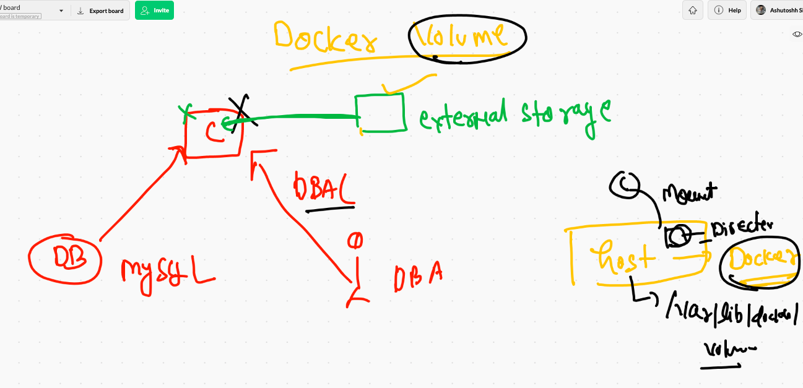
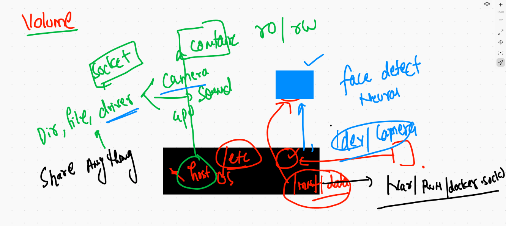

# Docker volumes 




## Creating mysql container without external storage 

```
docker  run -itd --name mydb -e MYSQL_ROOT_PASSWORD=Oracle098  mysql:5.6

❯ docker  ps
CONTAINER ID   IMAGE       COMMAND                  CREATED              STATUS              PORTS      NAMES
df03af0bed21   mysql:5.6   "docker-entrypoint.s…"   About a minute ago   Up About a minute   3306/tcp   mydb


```
## Access db container 

```
❯ docker  exec  -it  mydb bash
root@df03af0bed21:/# 

root@df03af0bed21:/# mysql -u root -pOracle098 
Warning: Using a password on the command line interface can be insecure.
Welcome to the MySQL monitor.  Commands end with ; or \g.
Your MySQL connection id is 1
Server version: 5.6.51 MySQL Community Server (GPL)

Copyright (c) 2000, 2021, Oracle and/or its affiliates. All rights reserved.

Oracle is a registered trademark of Oracle Corporation and/or its
affiliates. Other names may be trademarks of their respective
owners.

Type 'help;' or '\h' for help. Type '\c' to clear the current input statement.

mysql> 


```

### volume examples 

```
 9320  docker  run -itd --name mydb -e MYSQL_ROOT_PASSWORD=Oracle098  mysql:5.6 
 9321  docker  exec  -it  mydb bash 
 9322  docker rm  mydb -f
 9323  history
 9324  docker  volume  ls
 9325  docker  run -itd --name mydb -e MYSQL_ROOT_PASSWORD=Oracle098  -v ashuvol2:/var/lib/mysql:rw     mysql:5.6 
 9326  docker  volume  ls
 9327  docker  exec  -it  mydb bash 
 9328  docker rm  mydb -f
 9329  docker volume  ls
 9330  docker  run -itd --name mydb -e MYSQL_ROOT_PASSWORD=Oracle098  -v ashuvol2:/var/lib/mysql:rw     mysql:5.6 
 9331  docker  exec  -it  mydb bash 


```

## any Directory you can use as. volume 

```
❯ docker  run -itd --name x7 -v  /etc:/mnt/new:ro   alpine  sh
a659447cf643ac8ed290d17ea0b8845894e719eb61a2fadef6d7a2a8aae80154
❯ docker  ps
CONTAINER ID   IMAGE       COMMAND                  CREATED         STATUS         PORTS      NAMES
a659447cf643   alpine      "sh"                     4 seconds ago   Up 2 seconds              x7
9438ebdc55f0   mysql:5.6   "docker-entrypoint.s…"   7 minutes ago   Up 7 minutes   3306/tcp   mydb
❯ docker  exec -it  x7 sh
/ # cd  /mnt/new/
/mnt/new # ls
afpovertcp.cfg                         localtime                              postfix
aliases                                locate.rc                              ppp
aliases.db                             mail.rc                                profile
apache2                                man.conf                               protocols

```

## Docker volume fine



