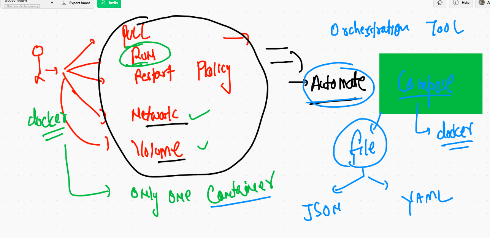
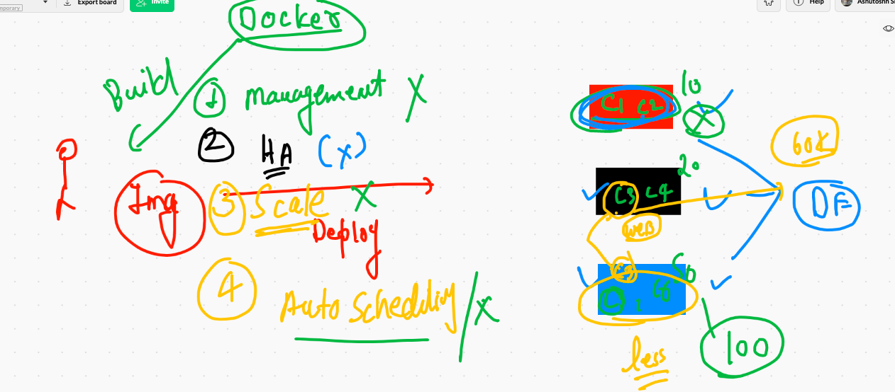
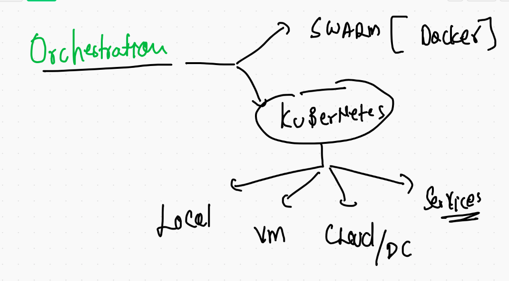
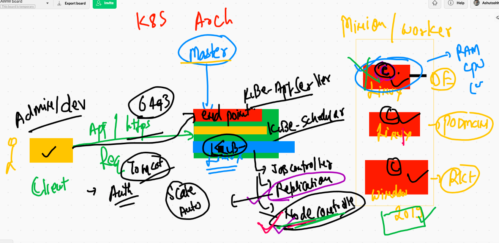
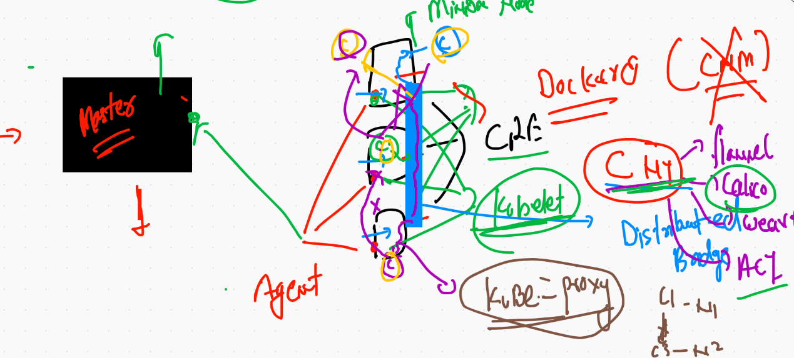
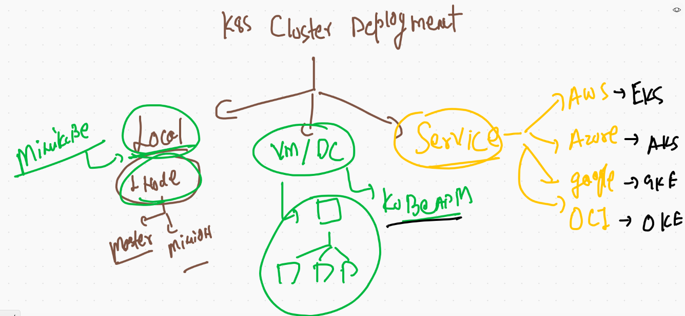
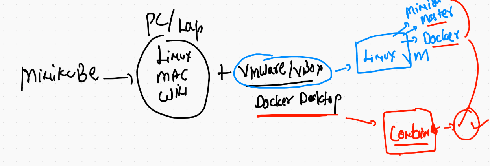
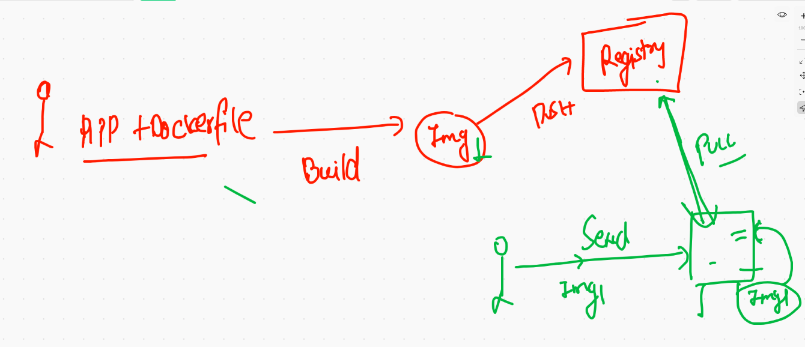
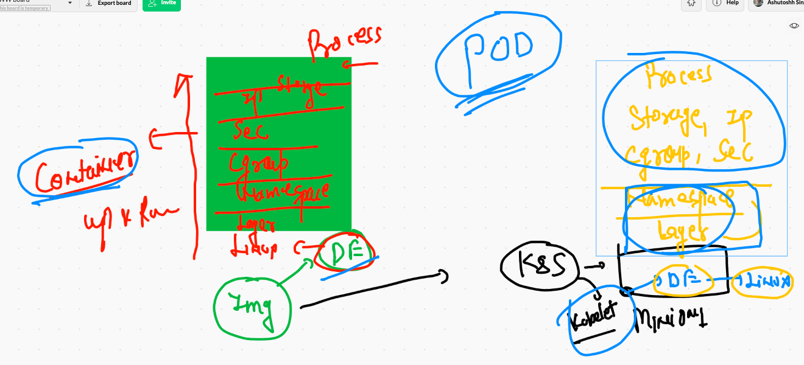
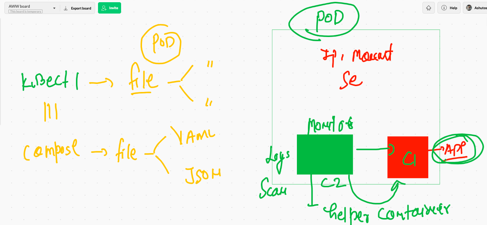

# Docker volumes 


## Creating mysql container without external storage 

```
docker  run -itd --name mydb -e MYSQL_ROOT_PASSWORD=Oracle098  mysql:5.6

❯ docker  ps
CONTAINER ID   IMAGE       COMMAND                  CREATED              STATUS              PORTS      NAMES
df03af0bed21   mysql:5.6   "docker-entrypoint.s…"   About a minute ago   Up About a minute   3306/tcp   mydb


```
## Access db container 

```
❯ docker  exec  -it  mydb bash
root@df03af0bed21:/# 

root@df03af0bed21:/# mysql -u root -pOracle098 
Warning: Using a password on the command line interface can be insecure.
Welcome to the MySQL monitor.  Commands end with ; or \g.
Your MySQL connection id is 1
Server version: 5.6.51 MySQL Community Server (GPL)

Copyright (c) 2000, 2021, Oracle and/or its affiliates. All rights reserved.

Oracle is a registered trademark of Oracle Corporation and/or its
affiliates. Other names may be trademarks of their respective
owners.

Type 'help;' or '\h' for help. Type '\c' to clear the current input statement.

mysql> 


```

### volume examples 

```
 9320  docker  run -itd --name mydb -e MYSQL_ROOT_PASSWORD=Oracle098  mysql:5.6 
 9321  docker  exec  -it  mydb bash 
 9322  docker rm  mydb -f
 9323  history
 9324  docker  volume  ls
 9325  docker  run -itd --name mydb -e MYSQL_ROOT_PASSWORD=Oracle098  -v ashuvol2:/var/lib/mysql:rw     mysql:5.6 
 9326  docker  volume  ls
 9327  docker  exec  -it  mydb bash 
 9328  docker rm  mydb -f
 9329  docker volume  ls
 9330  docker  run -itd --name mydb -e MYSQL_ROOT_PASSWORD=Oracle098  -v ashuvol2:/var/lib/mysql:rw     mysql:5.6 
 9331  docker  exec  -it  mydb bash 


```

## any Directory you can use as. volume 

```
❯ docker  run -itd --name x7 -v  /etc:/mnt/new:ro   alpine  sh
a659447cf643ac8ed290d17ea0b8845894e719eb61a2fadef6d7a2a8aae80154
❯ docker  ps
CONTAINER ID   IMAGE       COMMAND                  CREATED         STATUS         PORTS      NAMES
a659447cf643   alpine      "sh"                     4 seconds ago   Up 2 seconds              x7
9438ebdc55f0   mysql:5.6   "docker-entrypoint.s…"   7 minutes ago   Up 7 minutes   3306/tcp   mydb
❯ docker  exec -it  x7 sh
/ # cd  /mnt/new/
/mnt/new # ls
afpovertcp.cfg                         localtime                              postfix
aliases                                locate.rc                              ppp
aliases.db                             mail.rc                                profile
apache2                                man.conf                               protocols

```

## Docker volume fine


## Docker compose 



## compose file version 

[compose file version](https://docs.docker.com/compose/compose-file/)

## Compose examples 

### 1 

```
version: '3.8'
volumes: # is for creating volume
 ashuvol5: # name of volume 
services: # This is for your application in container form
 frontend: # name of app here everything is application 
  image: alpine
  container_name: ashuc123
  command: ping google.com
  
 ```
 
 ### RUnning compose file 
 
 ```
 ❯ cd  mycomposefiles
❯ ls
docker-compose.yaml hello.yaml
❯ docker-compose  -f  hello.yaml up  -d
Creating network "mycomposefiles_default" with the default driver
Creating ashuc123 ... done
❯ docker-compose ps
  Name         Command       State   Ports
------------------------------------------
ashuc123   ping google.com   Up           

```

## Example 2 

```
version: '3.8'
networks: # creating network 
 ashubr1: 
services: 
 mywebapp:
  image: mywebapp:v001 
  build: . # location of Dockerfile
  networks: # using netowrk 
   - ashubr1 
  container_name: ashuxc5 # name of container 
  ports:
   - "8899:80"

# docker build 
#  docker run 
# docker network create 
# because since file version 2 network is automatically getting created

```

## Example 3 

```
version: '3.8'
networks: # creating network 
 ashubr1: 
services: 
 mywebapp:
  image: mywebapp:v001 
  build: 
    context: .
    dockerfile: ashu.dockerfile
  networks: # using netowrk 
   - ashubr1 
  container_name: ashuxc5 # name of container 
  ports:
   - "8899:80"

# docker build 
#  docker run 
# docker network create 
# because since file version 2 network is automatically getting created

```

## Problems in Container management 



## orchestration engine 



## Reach here 

[k8sdocs](https://kubernetes.io/docs/home/)

## k8s architecture 


## componets on master node 



## mInion Node 




## cluster deployment methods 



## Minikube in one line 



## Minikube download link 


[download](https://minikube.sigs.k8s.io/docs/start/)


### kubectl version check 

```
 kubectl  version  --client
Client Version: version.Info{Major:"1", Minor:"20", GitVersion:"v1.20.2", GitCommit:"faecb196815e248d3ecfb03c680a4507229c2a56", GitTreeState:"clean", BuildDate:"2021-01-13T13:28:09Z", GoVersion:"go1.15.5", Compiler:"gc", Platform:"darwin/amd64"}

```

## checking kubernetes client & cluster version 

```
 kubectl  version
Client Version: version.Info{Major:"1", Minor:"20", GitVersion:"v1.20.2", GitCommit:"faecb196815e248d3ecfb03c680a4507229c2a56", GitTreeState:"clean", BuildDate:"2021-01-13T13:28:09Z", GoVersion:"go1.15.5", Compiler:"gc", Platform:"darwin/amd64"}
Server Version: version.Info{Major:"1", Minor:"20", GitVersion:"v1.20.2", GitCommit:"faecb196815e248d3ecfb03c680a4507229c2a56", GitTreeState:"clean", BuildDate:"2021-01-13T13:20:00Z", GoVersion:"go1.15.5", Compiler:"gc", Platform:"linux/amd64"}


````

### checking nodes 

```
❯ kubectl  cluster-info
Kubernetes control plane is running at https://127.0.0.1:55000
KubeDNS is running at https://127.0.0.1:55000/api/v1/namespaces/kube-system/services/kube-dns:dns/proxy

To further debug and diagnose cluster problems, use 'kubectl cluster-info dump'.
❯ 
❯ kubectl  get  nodes
NAME       STATUS   ROLES                  AGE   VERSION
minikube   Ready    control-plane,master   17m   v1.20.2


```

## deployment simple steps 




## Container to Pod journey 



## FInal discussion about Pod



## POds

### Example 1 

```
apiVersion: v1 # kubernetes apiversion for Pod 
kind: Pod
metadata: # info about Pod 
 name: ashupod-1 # name of the Pod
# this will common in multiple cases 
spec: # here info about application that has container / storage / security
 containers:
 - image: nginx # image from docker hub 
   name: ashuc1  # name of container 
   ports:
   - containerPort: 80 # application port 

```

## pod 

```
❯ cd  Desktop/myimages/PODS
❯ ls
ashupod1.yaml
❯ kubectl   get   pods
No resources found in default namespace.
❯ kubectl  apply -f  ashupod1.yaml
pod/ashupod-1 created
❯ 
❯ kubectl   get   pods
NAME        READY   STATUS              RESTARTS   AGE
ashupod-1   0/1     ContainerCreating   0          11s
❯ kubectl   get   pods
NAME        READY   STATUS              RESTARTS   AGE
ashupod-1   0/1     ContainerCreating   0          17s
❯ kubectl   get   pods
NAME        READY   STATUS    RESTARTS   AGE
ashupod-1   1/1     Running   0          30s

```

### describe Pod 

```
❯ kubectl   describe   pods  ashupod-1
Name:         ashupod-1
Namespace:    default
Priority:     0
Node:         minikube/192.168.49.2
Start Time:   Wed, 03 Mar 2021 15:29:10 +0530
Labels:       <none>
Annotations:  <none>
Status:       Running
IP:           172.17.0.3
IPs:
  IP:  172.17.0.3
Containers:
  ashuc1:
    Container ID:   docker://6bf931fce3289bd67206a2400e179b85a1626a2a3c1e4475ce11769caeda9c39
    Image:          nginx
    Image ID:       docker-pullable://nginx@sha256:f3693fe50d5b1df1ecd315d54813a77afd56b0245a404055a946574deb6b34fc
    Port:           80/TCP
    Host Port:      0/TCP
    State:          Running
      Started:      Wed, 03 Mar 2021 15:29:37 +0530
    Ready:          True
    Restart Count:  0

```

## to access application from  k8s client machine 

```
❯ kubectl   get   pods  -o wide
NAME        READY   STATUS    RESTARTS   AGE     IP           NODE       NOMINATED NODE   READINESS GATES
ashupod-1   1/1     Running   0          4m18s   172.17.0.3   minikube   <none>           <none>
❯ kubectl  port-forward  ashupod-1   1133:80
Forwarding from 127.0.0.1:1133 -> 80
Forwarding from [::1]:1133 -> 80
Handling connection for 1133
Handling connection for 1133

```

## auto generate YAML 

```
❯ kubectl   run  ashupod2  --image=nginx --port=80 --dry-run=client -o yaml
apiVersion: v1
kind: Pod
metadata:
  creationTimestamp: null
  labels:
    run: ashupod2
  name: ashupod2
spec:
  containers:
  - image: nginx
    name: ashupod2
    ports:
    - containerPort: 80
    resources: {}
  dnsPolicy: ClusterFirst
  restartPolicy: Always

```

## Saving output in a file 

```
kubectl   run  ashupod2  --image=nginx --port=80 --dry-run=client -o yaml >ashupod2.yaml
❯ kubectl   run  ashupod2  --image=nginx --port=80 --dry-run=client -o json  >p.json
❯ ls
ashupod1.yaml ashupod2.yaml p.json


```

## pod creating from command line 

```
9437  kubectl   run  ashupod2  --image=nginx --port=80 
 9438  kubectl  get   pods
 
```

## history 

```
9429  kubectl apply -f  ashupod2.yaml
 9430  kubectl  get  pods
 9431  kubectl delete po ashupod2
 9432  kubectl  apply -f p.json
 9433  kubectl  get  pods
 9434  kubectl delete po ashupod2
 9435  history
 9436  kubectl  get  po 
 9437  kubectl   run  ashupod2  --image=nginx --port=80 
 9438  kubectl  get   pods
 9439  history
 9440  kubectl get  po 
 9441  kubectl   exec  -it  ashupod2  -- bash 
 9442  history
 9443  kubectl  logs  -f  ashupod2
 9444  kubectl delete  pod ashupod2
 
 ```
 
 

