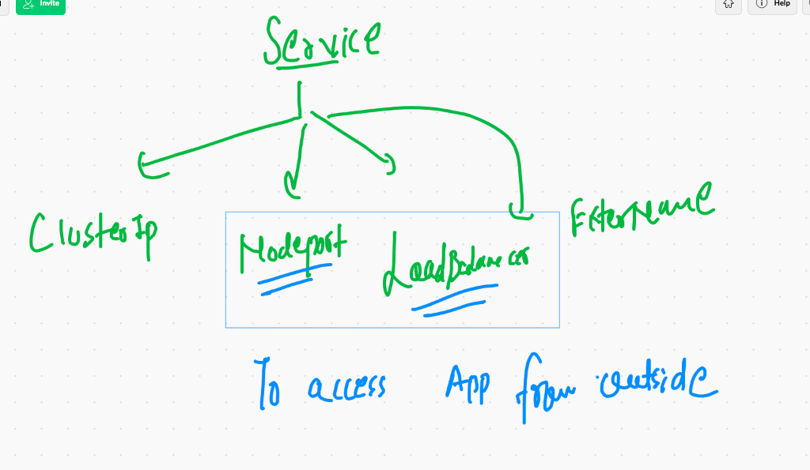
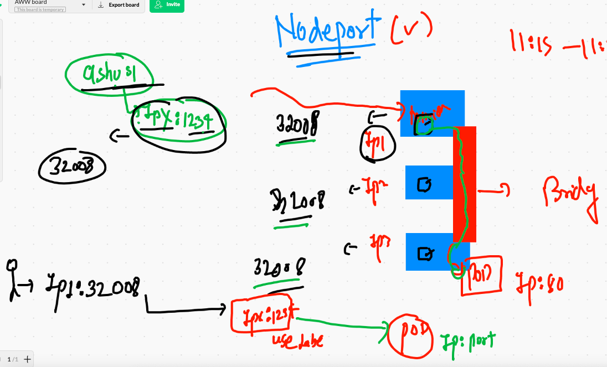
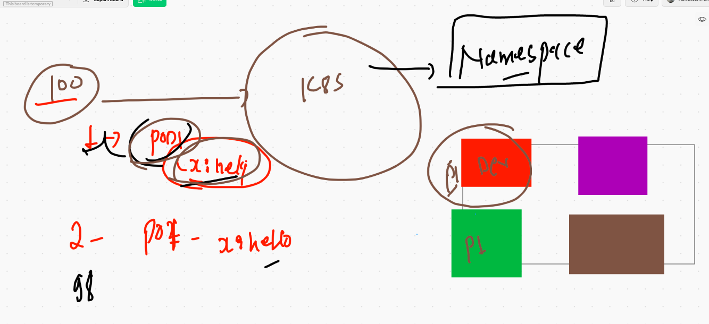
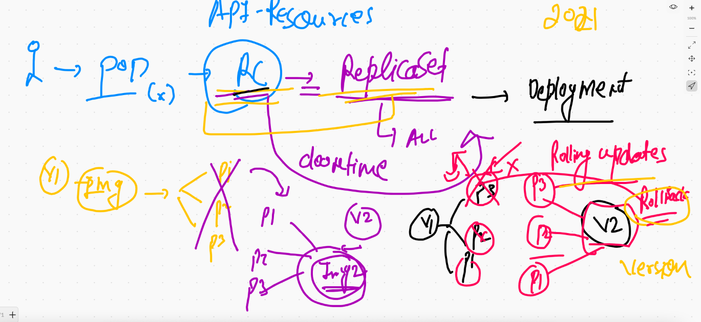
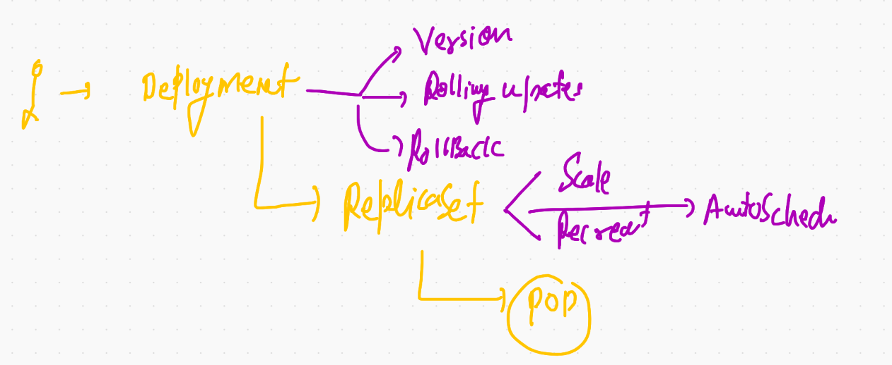
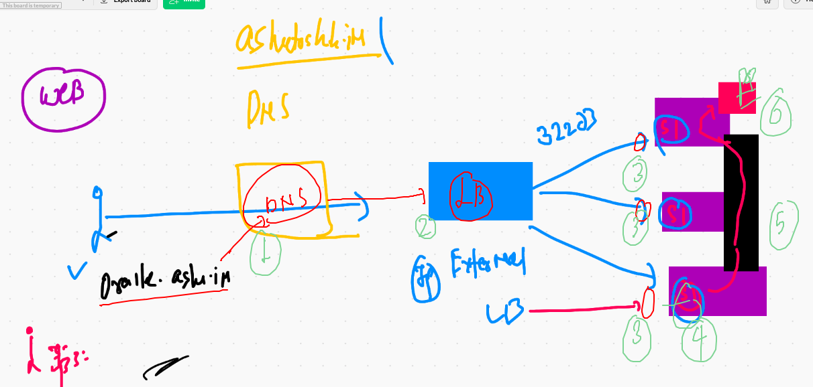

# Remote cluster connecting 

```
❯ kubectl  get  nodes --kubeconfig  admin.conf
NAME          STATUS   ROLES                  AGE   VERSION
master-node   Ready    control-plane,master   17h   v1.20.4
minion-1      Ready    <none>                 17h   v1.20.4
minion-2      Ready    <none>                 17h   v1.20.4
minion-3      Ready    <none>                 17h   v1.20.4
❯ 
❯ 
❯ kubectl  get  pods  --kubeconfig  admin.conf
No resources found in default namespace.

```

## IN mac / LInux you can set ENV variable 

```

❯ export KUBECONFIG=/Users/fire/Desktop/oracle1stmarch2021/admin.conf
❯ echo $KUBECONFIG
/Users/fire/Desktop/oracle1stmarch2021/admin.conf
❯ kubectl get  nodes
NAME          STATUS   ROLES                  AGE   VERSION
master-node   Ready    control-plane,master   17h   v1.20.4
minion-1      Ready    <none>                 17h   v1.20.4
minion-2      Ready    <none>                 17h   v1.20.4
minion-3      Ready    <none>                 17h   v1.20.4
❯ kubectl get  po
No resources found in default namespace.

```
## For windows open powershell and 

```
$env:KUBECONFIG="PATHtoadmin.conf"

```

## setting admin.conf in home directory of any OS user 


## DEploying pod 

```
❯ kubectl  get  pods -o wide
NAME         READY   STATUS    RESTARTS   AGE     IP                NODE       NOMINATED NODE   READINESS GATES
ashupod-1    1/1     Running   0          5m54s   192.168.113.3     minion-2   <none>           <none>
ashupod2     1/1     Running   0          8m10s   192.168.107.131   minion-3   <none>           <none>
av-4         1/1     Running   0          4m54s   192.168.107.132   minion-3   <none>           <none>
pod-2        1/1     Running   0          6m56s   192.168.46.195    minion-1   <none>           <none>
pravepod-1   1/1     Running   0          4m59s   192.168.113.4     minion-2   <none>           <none>
xy-1         1/1     Running   0          67s     192.168.46.196    minion-1   <none>           <none>
❯ 
❯ 
❯ kubectl  get  pods ashupod2   -o wide
NAME       READY   STATUS    RESTARTS   AGE     IP                NODE       NOMINATED NODE   READINESS GATES
ashupod2   1/1     Running   0          8m14s   192.168.107.131   minion-3   <none>           <none>


```

##  static scheduling 

```
❯ kubectl  replace -f ashupod2.yaml --force
pod "ashupod2" deleted
pod/ashupod2 replaced
❯ kubectl  get  pods ashupod2   -o wide
NAME       READY   STATUS    RESTARTS   AGE   IP               NODE       NOMINATED NODE   READINESS GATES
ashupod2   1/1     Running   0          7s    192.168.46.197   minion-1   <none>           <none>


```

## Deploying pod from Docker hub person public image

```
kubectl  run  webpod --image=dockerashu/htmlapp:v1  --port 80 --dry-run=client -o yaml >web.yaml
 kubectl  apply -f  web.yaml
pod/webpod created
```


## accessing your application locally from kubectl client machine 

```
❯ kubectl  port-forward  webpod  1234:80
Forwarding from 127.0.0.1:1234 -> 80
Forwarding from [::1]:1234 -> 80
Handling connection for 1234
Handling connection for 1234

```

## Your service can handle 


## service will use label of POD to find 


## pod with label 

```
apiVersion: v1 # kubernetes apiversion for Pod 
kind: Pod
metadata: # info about Pod 
 name: ashupod-1 # name of the Pod
 labels: # we are setting lable of my pod
  x: ashulb1 # key and value 
# this will common in multiple cases 
spec: # here info about application that has container / storage / security
 containers:
 - image: nginx # image from docker hub 
   name: ashuc1  # name of container 
   ports:
   - containerPort: 80 # application port 
 

```

## checking label 

```
❯ kubectl get  po  --show-labels
NAME         READY   STATUS    RESTARTS   AGE   LABELS
ashupod-1    1/1     Running   0          36m   <none>
ashupod2     1/1     Running   0          28m   run=ashupod2
av-4         1/1     Running   0          22m   pod=goodpod
pod-2        1/1     Running   0          37m   run=pod-2
pravepod-1   1/1     Running   0          35m   x=labelprav
sshpod1      1/1     Running   0          28m   run=sshpod1
webpod       1/1     Running   0          24m   run=webpod
xy-1         1/1     Running   0          31m   <none>
❯ kubectl get  po webpod  --show-labels
NAME     READY   STATUS    RESTARTS   AGE   LABELS
webpod   1/1     Running   0          25m   run=webpod
❯ kubectl get  po webpod  --show-labels  -o wide
NAME     READY   STATUS    RESTARTS   AGE   IP              NODE       NOMINATED NODE   READINESS GATES   LABELS
webpod   1/1     Running   0          25m   192.168.113.5   minion-2   <none>           <none>            run=webpod


```

## type of service 



## Nodeport service 



## creating node port service 

```
 kubectl  create  service  nodeport  ashusvc1  --tcp 1234:80  --dry-run=client -o yaml >service.yml
 
===
apiVersion: v1
kind: Service
metadata:
  creationTimestamp: null
  labels: # label of service 
    app: ashusvc1
  name: ashusvc1  # name of service 
spec:
  ports: # ip port info 
  - name: myport
    port: 1234 # service port number 
    protocol: TCP # protocol
    targetPort: 80  # application port 
  selector: # This field is for find POD 
    run: webpod # label of POD to find 
  type: NodePort  # type of service 
status:
  loadBalancer: {}

```

## checking service 

```
❯ kubectl apply -f service.yml
service/ashusvc1 created
❯ kubectl get service
NAME           TYPE        CLUSTER-IP       EXTERNAL-IP   PORT(S)          AGE
abhisheksvc1   NodePort    10.96.253.112    <none>        1234:31635/TCP   118s
ashusvc1       NodePort    10.105.116.233   <none>        1234:30819/TCP   5s
avinservice    NodePort    10.100.13.213    <none>        8899:30317/TCP   2m11s
kubernetes     ClusterIP   10.96.0.1        <none>        443/TCP          18h
testsvc1       NodePort    10.100.8.182     <none>        1334:31776/TCP   47s
xy             NodePort    10.105.113.138   <none>        8080:30804/TCP   4m13s

```

## cleaning up 

```
❯ kubectl delete all --all
pod "aj" deleted
pod "ashupod-1" deleted
pod "ashupod2" deleted
pod "av-4" deleted
pod "pod-2" deleted
pod "pravepod-1" deleted
pod "sshpod1" deleted
pod "webpod" deleted
pod "xy-1" deleted
service "abhisheksvc1" deleted
service "ashusvc1" deleted
service "avinservice" deleted
service "kubernetes" deleted
service "serviceprav" deleted
service "sshsvc1" deleted
service "testsvc1" deleted
service "xy" deleted


```

## namespace 



## kube-system namespace 

```
❯ kubectl  get  pods  -n  kube-system
NAME                                       READY   STATUS    RESTARTS   AGE
calico-kube-controllers-6949477b58-xdtk5   1/1     Running   1          19h
calico-node-9mmz8                          1/1     Running   1          19h
calico-node-cgwtl                          1/1     Running   1          19h
calico-node-h9sh4                          1/1     Running   1          19h
calico-node-tp25s                          1/1     Running   1          19h
coredns-74ff55c5b-6bn9j                    1/1     Running   1          19h
coredns-74ff55c5b-klw6n                    1/1     Running   1          19h
etcd-master-node                           1/1     Running   1          19h
kube-apiserver-master-node                 1/1     Running   1          19h
kube-controller-manager-master-node        1/1     Running   1          19h
kube-proxy-cs4sw                           1/1     Running   1          19h
kube-proxy-ltvhr                           1/1     Running   1          19h
kube-proxy-qww7k                           1/1     Running   1          19h
kube-proxy-r4nsw                           1/1     Running   1          19h
kube-scheduler-master-node                 1/1     Running   1          19h

```

## priavte namespace creation 

```
❯ kubectl  create namespace   ashu-space
namespace/ashu-space created
❯ kubectl  get  ns
NAME              STATUS   AGE
ashu-space        Active   7s
default           Active   19h
kube-node-lease   Active   19h
kube-public       Active   19h
kube-system       Active   19h

```

## deploy pod in private namespace 

```
❯ kubectl  apply -f  web.yaml
pod/webpod created
❯ kubectl  apply -f  service.yml
service/ashusvc1 created
❯ 
❯ kubectl  get  po
No resources found in default namespace.
❯ 
❯ kubectl  get  po  -n ashu-space
NAME     READY   STATUS    RESTARTS   AGE
webpod   1/1     Running   0          19s
❯ kubectl  get  svc   -n ashu-space
NAME       TYPE       CLUSTER-IP      EXTERNAL-IP   PORT(S)          AGE
ashusvc1   NodePort   10.108.202.57   <none>        1234:30712/TCP   19s
❯ 
❯ 
❯ kubectl  get  pod,svc   -n ashu-space
NAME         READY   STATUS    RESTARTS   AGE
pod/webpod   1/1     Running   0          33s

NAME               TYPE       CLUSTER-IP      EXTERNAL-IP   PORT(S)          AGE
service/ashusvc1   NodePort   10.108.202.57   <none>        1234:30712/TCP   28s


```

## cleaning up 

```
9603  kubectl  apply -f  web.yaml
 9604  kubectl  apply -f  service.yml
 9605  kubectl  get  po 
 9606  kubectl  get  po  -n ashu-space 
 9607  kubectl  get  svc   -n ashu-space 
 9608  kubectl  get  pod,svc   -n ashu-space 
 9609  kubectl  get  all   -n ashu-space 
 9610  history
 9611  kubectl  get  all   -n ashu-space 
 9612  kubectl  apply -f  service.yml
 9613  kubectl  get  all   -n ashu-space 
❯ kubectl  delete all --all -n ashu-space
pod "webpod" deleted
service "ashusvc1" deleted

```

## multiple api-resource by single yaml file

```
 kubectl  apply -f  web.yaml
pod/webpod created
service/ashusvc1 created
❯ kubectl  get  all  -n ashu-space
NAME         READY   STATUS    RESTARTS   AGE
pod/webpod   1/1     Running   0          9s

NAME               TYPE       CLUSTER-IP     EXTERNAL-IP   PORT(S)          AGE
service/ashusvc1   NodePort   10.98.230.55   <none>        1234:32328/TCP   9s

```

## REplication 

```
❯ kubectl  apply -f  helloapp.yaml  -n ashu-space
replicationcontroller/ashu-rc created
❯ 
❯ kubectl  get  rc  -n ashu-space
NAME      DESIRED   CURRENT   READY   AGE
ashu-rc   1         1         1       10s
❯ kubectl  get  pod   -n ashu-space
NAME            READY   STATUS    RESTARTS   AGE
ashu-rc-98w4p   1/1     Running   0          17s
❯ kubectl  get  pod   -n ashu-space -o wide
NAME            READY   STATUS    RESTARTS   AGE   IP               NODE       NOMINATED NODE   READINESS GATES
ashu-rc-98w4p   1/1     Running   0          49s   192.168.113.11   minion-2   <none>           <none>
❯ 
❯ kubectl  get  rc  -n ashu-space
NAME      DESIRED   CURRENT   READY   AGE
ashu-rc   1         1         1       97s
❯ 
❯ kubectl  expose  rc  ashu-rc  --type NodePort --port 1234 --target-port 80 --name svc1 -n ashu-space
service/svc1 exposed
❯ kubectl  get  svc -n ashu-space
NAME   TYPE       CLUSTER-IP       EXTERNAL-IP   PORT(S)          AGE
svc1   NodePort   10.106.195.104   <none>        1234:32551/TCP   39s


```
## history 

```
72  kubectl  create  service  nodeport  ashusvc1  --tcp 1234:80  --dry-run=client -o yaml >service.yml
 9573  kubectl get  po 
 9574  kubectl get  po  webpod --show-labels 
 9575  history
 9576  kubectl get  all
 9577  kubectl apply -f service.yml
 9578  kubectl get service
 9579  kubectl  get  po -o wide
 9580  kubectl  get  svc
 9581  history
 9582  kubectl  port-forward  webpod  80:8080 
 9583  history
 9584  kubectl  get  svc
 9585  kubectl delete all --all
 9586  kubectl  get po 
 9587  kubectl  get  svc
 9588  history
 9589  kubectl  get namespace 
 9590  kubectl  get ns
 9591  kubectl  get  pods
 9592  cat  ~/.kube/config
 9593  history
 9594  kubectl  get  pods
 9595  kubectl  get  ns
 9596  kubectl  get  pods  -n  default 
 9597  kubectl  get  pods  -n  kube-system 
 9598  history
 9599  kubectl  create namespace   ashu-space 
 9600  kubectl  get  ns
 9601  history
 9602  kubectl  get  ns
 9603  kubectl  apply -f  web.yaml
 9604  kubectl  apply -f  service.yml
 9605  kubectl  get  po 
 9606  kubectl  get  po  -n ashu-space 
 9607  kubectl  get  svc   -n ashu-space 
 9608  kubectl  get  pod,svc   -n ashu-space 
 9609  kubectl  get  all   -n ashu-space 
 9610  history
 9611  kubectl  get  all   -n ashu-space 
 9612  kubectl  apply -f  service.yml
 9613  kubectl  get  all   -n ashu-space 
 9614  history
 9615  kubectl  delete all --all -n ashu-space 
 9616  history
 9617  kubectl  get  po -n ashu-space 
 9618  kubectl  get  svc -n ashu-space 
 9619  kubectl  apply -f  web.yaml 
 9620  kubectl  get  all  -n ashu-space 
 9621  kubectl  delete all --all -n ashu-space 
 9622  history
 9623  kubectl  apply -f  helloapp.yaml  -n ashu-space  
 9624  kubectl  get  rc  -n ashu-space 
 9625  kubectl  get  pod   -n ashu-space 
 9626  kubectl  get  pod   -n ashu-space -o wide
 9627  kubectl  get  rc  -n ashu-space 
 9628  kubectl  expose  rc  ashu-rc  --type NodePort --port 1234 --target-port 80 --name svc1 -n ashu-space 
 9629  kubectl  get  svc -n ashu-space 
 9630  history
 9631  kubectl apply -f  ashupod1.yaml
 9632  kubectl get po 
 9633  kubectl expose  pod ashupod-1  --type NodePort --port 80 --target-port 80 --name x1


```

## changing namespace to default 

```
  kubectl  config set-context  --current --namespace=ashu-space
Context "kubernetes-admin@kubernetes" modified.
❯ 


```

## scaling in RC 

```
❯ kubectl  get  rc
NAME      DESIRED   CURRENT   READY   AGE
ashu-rc   1         1         1       91m
❯ kubectl apply -f helloapp.yaml
replicationcontroller/ashu-rc configured
service/ashusvc1 created
❯ kubectl  get  rc
NAME      DESIRED   CURRENT   READY   AGE
ashu-rc   2         2         2       91m
❯ kubectl get  po -o wide
NAME            READY   STATUS    RESTARTS   AGE    IP               NODE       NOMINATED NODE   READINESS GATES
ashu-rc-7hmzg   1/1     Running   0          105s   192.168.46.204   minion-1   <none>           <none>
ashu-rc-97hpn   1/1     Running   0          12s    192.168.113.14   minion-2   <none>           <none>
❯ 
❯ 
❯ kubectl  scale  rc  ashu-rc  --replicas=5
replicationcontroller/ashu-rc scaled
❯ kubectl get  po -o wide
NAME            READY   STATUS    RESTARTS   AGE     IP                NODE       NOMINATED NODE   READINESS GATES
ashu-rc-5n5q4   1/1     Running   0          3s      192.168.46.205    minion-1   <none>           <none>
ashu-rc-7hmzg   1/1     Running   0          2m27s   192.168.46.204    minion-1   <none>           <none>
ashu-rc-97hpn   1/1     Running   0          54s     192.168.113.14    minion-2   <none>           <none>
ashu-rc-lpzvk   1/1     Running   0          3s      192.168.113.15    minion-2   <none>           <none>
ashu-rc-mmzd7   1/1     Running   0          3s      192.168.107.143   minion-3   <none>           <none>
❯ kubectl  scale  rc  ashu-rc  --replicas=1
replicationcontroller/ashu-rc scaled


```

## Welcome to Deployment 



## reality of Deployment 



## Deployment creation 

```
kubectl  create  deployment  ashuapp  --image=dockerashu/oraclemarch:2021v1  --dry-run=client -o yaml >deploy.yml
```


## creating  service and saving in above file 

```
❯ kubectl  create  deployment  ashuapp  --image=dockerashu/oraclemarch:2021v1  --dry-run=client -o yaml >deploy.yml
❯ kubectl  create  service  nodeport mydepsvc  --tcp 1234:80   --dry-run=client -o yaml >>deploy.yml
```

### deployment of dep 

```
❯ kubectl apply -f  deploy.yml
deployment.apps/ashuapp created
service/mydepsvc created
❯ kubectl  get  deployment
NAME      READY   UP-TO-DATE   AVAILABLE   AGE
ashuapp   1/1     1            1           9s
❯ kubectl  get  deplo
error: the server doesn't have a resource type "deplo"
❯ kubectl  get  deploy
NAME      READY   UP-TO-DATE   AVAILABLE   AGE
ashuapp   1/1     1            1           18s
❯ kubectl  get  rs
NAME                 DESIRED   CURRENT   READY   AGE
ashuapp-66dc7dc678   1         1         1       22s
❯ kubectl  get  po
NAME                       READY   STATUS    RESTARTS   AGE
ashuapp-66dc7dc678-r4h2d   1/1     Running   0          25s
❯ kubectl  get  svc
NAME       TYPE       CLUSTER-IP     EXTERNAL-IP   PORT(S)          AGE
mydepsvc   NodePort   10.109.42.89   <none>        1234:32203/TCP   28s

```

### scaling POD on deployment 

```
❯ kubectl  scale deploy  ashuapp --replicas=3
deployment.apps/ashuapp scaled
❯ kubectl get  deploy
NAME      READY   UP-TO-DATE   AVAILABLE   AGE
ashuapp   3/3     3            3           3m27s

```

## deployment with LB 




