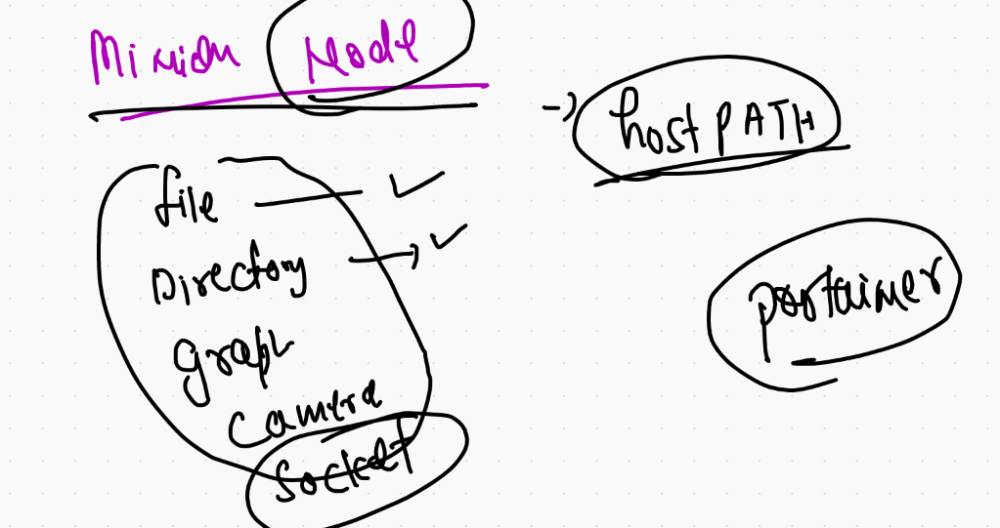
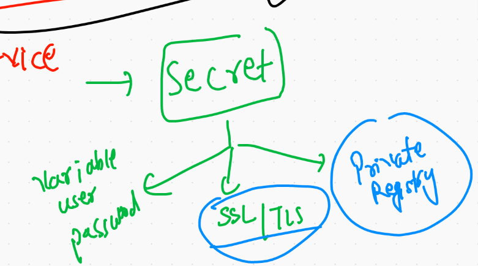

# K8s volume 

## EmptyDir TYpe 

```
❯ ls
alp.yml       ashupod2.yaml deploy.yml    helloapp.yaml service.yml
ashupod1.yaml ashuwebapp    empvol.yml    p.json        web.yaml
❯ kubectl  apply -f   empvol.yml
pod/podx1 created
❯ kubectl  get   po
NAME    READY   STATUS    RESTARTS   AGE
podx1   2/2     Running   0          7s
❯ kubectl  exec -it  podx1 -c  ashuc1 -- /bin/sh
/ # 
/ # cd /mnt/data/
/mnt/data # ls
a.txt
/mnt/data # exit
❯ kubectl  exec -it  podx1 -c  ashuc2 -- /bin/bash
root@podx1:/# 
root@podx1:/# 
root@podx1:/# 
root@podx1:/# cd  /usr/share/nginx/html/
root@podx1:/usr/share/nginx/html# ls
a.txt
root@podx1:/usr/share/nginx/html# 


```

## Hostpath volume 




## portainer deployment 

```
❯ kubectl apply -f  portainer.yml
deployment.apps/helloportainer created
❯ kubectl get deploy
NAME             READY   UP-TO-DATE   AVAILABLE   AGE
helloportainer   1/1     1            1           7s
❯ kubectl  expose deploy  helloportainer  --type NodePort --port 1234 --target-port 9000
service/helloportainer exposed
❯ 
❯ kubectl get svc
NAME             TYPE       CLUSTER-IP     EXTERNAL-IP   PORT(S)          AGE
helloportainer   NodePort   10.98.47.125   <none>        1234:31723/TCP   7s

```

## MYsql DB 

```
kubectl  create  deployment   ashudb --image=mysql:5.6  --dry-run=client -o yaml  >db.yml

```

## secret in k8s 



## creating secret for DB password  it take input in key : value pair 

```
❯ kubectl  create  secret   generic  ashusec1  --from-literal   sqlpw=Oracle12345
secret/ashusec1 created
❯ kubectl  get  secret
NAME                  TYPE                                  DATA   AGE
ashusec1              Opaque                                1      29s
default-token-tnnbm   kubernetes.io/service-account-token   3      23h

```

###

```
❯ kubectl  describe secret  ashusec1
Name:         ashusec1
Namespace:    ashu-space
Labels:       <none>
Annotations:  <none>

Type:  Opaque

Data
====
sqlpw:  11 bytes

```


