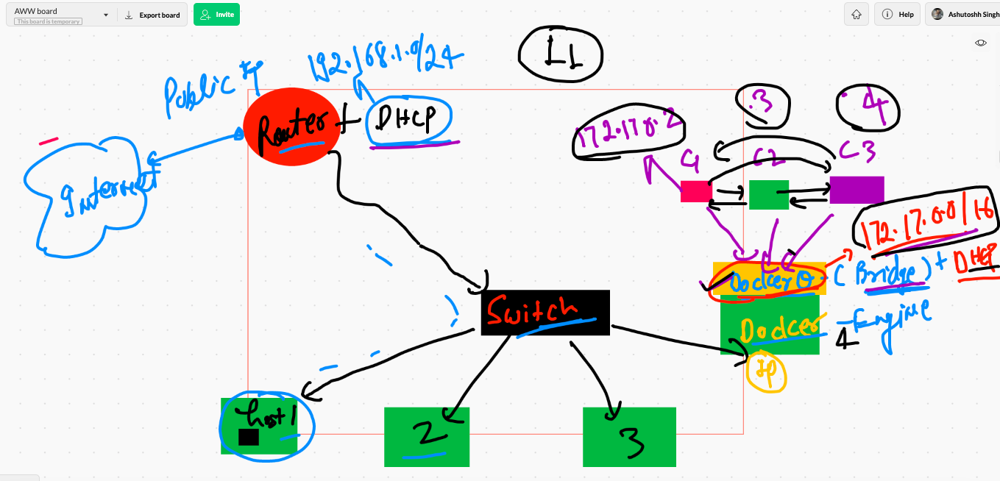
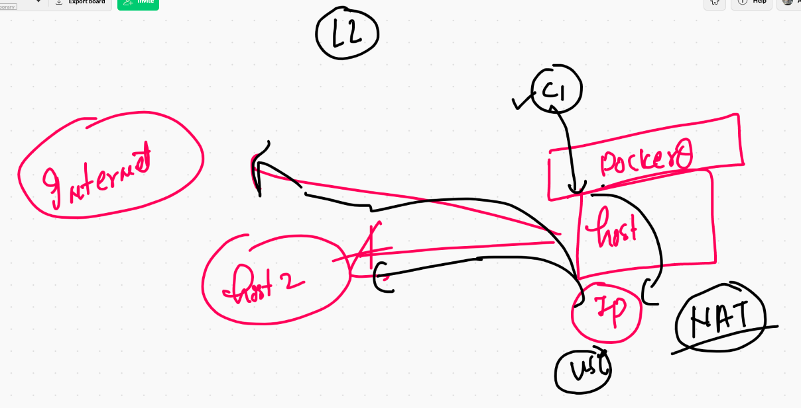
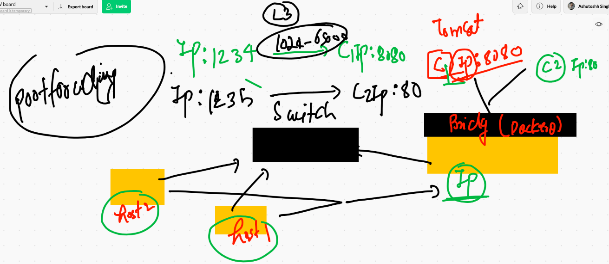
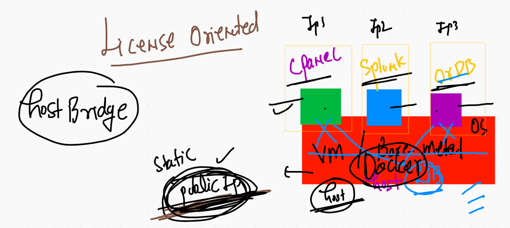
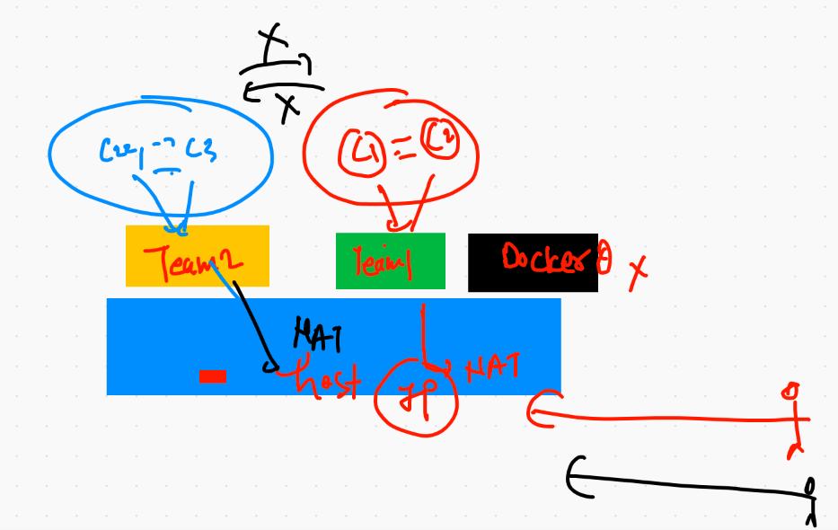
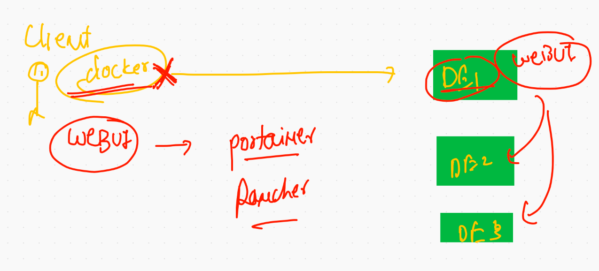
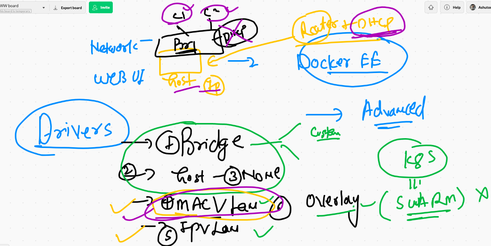
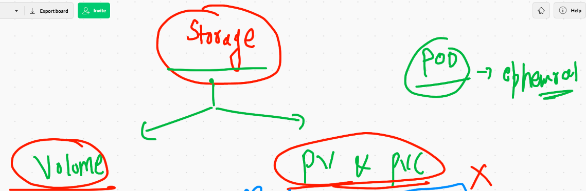

# Recap for day 1 

## CRE 


## docker engine and its few component understanding 


## Container has these many things 

```
❯ docker  run -it  --rm  alpine  sh
/ # 
/ # ls
bin    dev    etc    home   lib    media  mnt    opt    proc   root   run    sbin   srv    sys    tmp    usr    var
/ # ps  -e
PID   USER     TIME  COMMAND
    1 root      0:00 sh
    9 root      0:00 ps -e
/ # free -m 
              total        used        free      shared  buff/cache   available
Mem:           1990         387         155         367        1447        1081
Swap:          1023          55         968
/ # fdisk -l
/ # ifconfig 
eth0      Link encap:Ethernet  HWaddr 02:42:AC:11:00:02  
          inet addr:172.17.0.2  Bcast:172.17.255.255  Mask:255.255.0.0
          UP BROADCAST RUNNING MULTICAST  MTU:1500  Metric:1
          RX packets:11 errors:0 dropped:0 overruns:0 frame:0
          TX packets:0 errors:0 dropped:0 overruns:0 carrier:0
          collisions:0 txqueuelen:0 
          RX bytes:906 (906.0 B)  TX bytes:0 (0.0 B)

lo        Link encap:Local Loopback  
          inet addr:127.0.0.1  Mask:255.0.0.0
          UP LOOPBACK RUNNING  MTU:65536  Metric:1
          RX packets:0 errors:0 dropped:0 overruns:0 frame:0
          TX packets:0 errors:0 dropped:0 overruns:0 carrier:0
          collisions:0 txqueuelen:1000 
          RX bytes:0 (0.0 B)  TX bytes:0 (0.0 B)


```

## Inspecting docker image with format 

```
❯ docker  inspect  dockerashu/ashupy:v4
[
    {
        "Id": "sha256:b692df35b0e37dbb12343e8be4655e692c9ea14ad37852733bf6f04bb04bea65",
        "RepoTags": [
            "dockerashu/ashupy:v4",
            "ashupy:v4"
        ],
        "RepoDigests": [
            "dockerashu/ashupy@sha256:ae7b1f1ed9f942ccee57af2e3989f77e29f1a202f987f63a0e4ee87723e27a89"
        ],
        "Parent": "",
        "Comment": "",
        "Created": "2021-03-01T09:41:40.1241772Z",
        "Container": "084116b8507bd333fe05d363a551c1fedb901f77fec3a65933994e1ae7c23e80",
        "ContainerConfig": {

-======


❯ docker  inspect  dockerashu/ashupy:v4   -f '{{.ID}}'
sha256:b692df35b0e37dbb12343e8be4655e692c9ea14ad37852733bf6f04bb04bea65
❯ docker  inspect  dockerashu/ashupy:v4   --format='{{.ID}}'
sha256:b692df35b0e37dbb12343e8be4655e692c9ea14ad37852733bf6f04bb04bea65
❯ docker  inspect  dockerashu/ashupy:v4   --format='{{.RepoTags}}'
[dockerashu/ashupy:v4 ashupy:v4]
❯ docker  inspect  dockerashu/ashupy:v4   --format='{{.ContainerConfig.Cmd}}'
[/bin/sh -c #(nop)  ENTRYPOINT ["python3" "/code/abc.py"]]

```

## Replacing entrypoint parent process

```
 docker  run -dit --name x2  --entrypoint ping   dockerashu/ashupy:v4   127.0.0.1
a5f5076826cf626cd84d5e61cb35bbec3ddefd26e040d4f138f27b6653fd53b2
❯ docker  ps
CONTAINER ID   IMAGE                  COMMAND                  CREATED          STATUS          PORTS     NAMES
a5f5076826cf   dockerashu/ashupy:v4   "ping 127.0.0.1"         6 seconds ago    Up 4 seconds              x2
76a256de7545   dockerashu/ashupy:v4   "python3 /code/abc.p…"   38 seconds ago   Up 36 seconds             x1

```

## Web server overview 


## apache httpd 


## systemd in containerd

[systemd](https://developers.redhat.com/blog/2016/09/13/running-systemd-in-a-non-privileged-container/)

##  supervisor for multiple service in container 

[contaienr service](https://docs.docker.com/config/containers/multi-service_container/)


## systemd not supported by docker by default 


## Building htmlwebapp with apache httpd 

```

9135  docker  build  -t   htmlwebapp:v1  . 
❯ docker  images
REPOSITORY               TAG       IMAGE ID       CREATED          SIZE
htmlwebapp               v1        a921071af74b   30 seconds ago   347MB

```

## creating container from image

```
❯ docker  run  -itd --name ashuwebc1  -p  2211:80  htmlwebapp:v1
b7c7c163b88c858285af0ffa4338217e7c67470ec7fb9a72d4827bb8857cf0ad
❯ docker  ps
CONTAINER ID   IMAGE                  COMMAND                  CREATED          STATUS          PORTS                  NAMES
b7c7c163b88c   htmlwebapp:v1          "/bin/sh -c '/usr/sb…"   4 seconds ago    Up 3 seconds    0.0.0.0:2211->80/tcp   ashuwebc1

```

## checking running container content 

```
❯ docker  exec -it  ashuwebc1  bash
[root@b7c7c163b88c /]# cd  /var/www/html/
[root@b7c7c163b88c html]# ls  -a
.  ..  images  index.html  styles

```

## Image pushing to container registry 


## Pushing image to Docker hub 

```
❯ docker  tag  a921071af74b  dockerashu/htmlapp:v1
❯ docker  login  -u dockerashu
Password: 
Login Succeeded
❯ docker  push   dockerashu/htmlapp:v1
The push refers to repository [docker.io/dockerashu/htmlapp]
be4df2baf212: Pushed 
e8e9e5112d4a: Pushing [=====================================>   

```

## using docker. to start a custom private registry 

```
docker  run -itd  -v  /myimages:/var/lib/registry  -p 5000:5000 --restart always   registry 
cd468f5e6c7511d6dcc3412f7d3a32bfad8b2b4d3e14cffba7dc974d313b1a96
[root@ip-172-31-79-103 ~]# docker  ps
CONTAINER ID        IMAGE               COMMAND                  CREATED             STATUS              PORTS                    NAMES
cd468f5e6c75        registry            "/entrypoint.sh /etc…"   4 seconds ago       Up 2 seconds        0.0.0.0:5000->5000/tcp

```

## PUshing to azure container registry 

```
❯ docker   tag  alpine:latest   ashutoshh.azurecr.io/alpine:v1
❯ 
❯ 
❯ docker  login   ashutoshh.azurecr.io  -u  ashutoshh
Password: 
Login Succeeded
❯ docker  push   ashutoshh.azurecr.io/alpine:v1
The push refers to repository [ashutoshh.azurecr.io/alpine]
cb381a32b229: Pushed 
v1: digest: sha256:4661fb57f7890b9145907a1fe2555091d333ff3d28db86c3bb906f6a2be93c87 size: 528
❯ 
❯ 
❯ docker  logout   ashutoshh.azurecr.io
Removing login credentials for ashutoshh.azurecr.io


```
## Java web with apache tomcat 


### build and create 

```

 docker  build  -t  tomcat:v1  . 
 ---
 
❯ docker  run -itd --name jspc1  -p  1100:8080  tomcat:v1
34b92da20339ab660a35d8ecd1a0cecfd557b1940eea7cce3ca8d6fec298400d
❯ docker  ps
CONTAINER ID   IMAGE           COMMAND                  CREATED             STATUS             PORTS                    NAMES
34b92da20339   tomcat:v1       "catalina.sh run"        7 seconds ago       Up 6 seconds       0.0.0.0:1100->8080/tcp   jspc1
b7c7c163b88c   htmlwebapp:v1   "/bin/sh -c '/usr/sb…"   About an hour ago   Up About an hour   0.0.0.0:2211->80/tcp     ashuwebc1

```


# Docker Networking ..




## checking default bridge 

```
❯ docker   network   ls
NETWORK ID     NAME      DRIVER    SCOPE
e36f4430876f   bridge    bridge    local
0cecd29f7ec2   host      host      local
c891d3c2e465   none      null      local
❯ docker   network   inspect  bridge
[
    {
        "Name": "bridge",
        "Id": "e36f4430876fcd05150fbcfbef579a1a0f5e92602b1b84e09a0ed1535bc9108e",
        "Created": "2021-02-28T06:39:13.704701975Z",
        "Scope": "local",
        "Driver": "bridge",
        "EnableIPv6": false,
        "IPAM": {
            "Driver": "default",
            "Options": null,
            "Config": [
                {
                    "Subnet": "172.17.0.0/16",
                    "Gateway": "172.17.0.1"
                }
            ]
        },
        "Internal": false,
        "Attachable": false,
        "Ingress": false,
        "ConfigFrom": {
            "Network": ""
        },
        "ConfigOnly": false,
        "Containers": {},
        "Options": {
            "com.docker.network.bridge.default_bridge": "true",
            "com.docker.network.bridge.enable_icc": "true",
            "com.docker.network.bridge.enable_ip_masquerade": "true",
            "com.docker.network.bridge.host_binding_ipv4": "0.0.0.0",
            "com.docker.network.bridge.name": "docker0",
            "com.docker.network.driver.mtu": "1500"
        },
        "Labels": {}
    }
]


```

## creating container to check ip 

```
❯ docker  run -itd --name x1 alpine ping 127.0.0.1
659b1722fc6c8c031932e6b04902ca27b14d718b35706a0ade948b1e48bcb817
❯ docker  ps
CONTAINER ID   IMAGE     COMMAND            CREATED         STATUS        PORTS     NAMES
659b1722fc6c   alpine    "ping 127.0.0.1"   3 seconds ago   Up 1 second             x1


```

## checking container ip 

### Method 1 

```
❯ docker  exec -it  x1  sh
/ # ifconfig 
eth0      Link encap:Ethernet  HWaddr 02:42:AC:11:00:02  
          inet addr:172.17.0.2  Bcast:172.17.255.255  Mask:255.255.0.0
          UP BROADCAST RUNNING MULTICAST  MTU:1500  Metric:1
          RX packets:11 errors:0 dropped:0 overruns:0 frame:0
          TX packets:0 errors:0 dropped:0 overruns:0 carrier:0
          collisions:0 txqueuelen:0 
          RX bytes:906 (906.0 B)  TX bytes:0 (0.0 B)

lo        Link encap:Local Loopback  
          inet addr:127.0.0.1  Mask:255.0.0.0
          UP LOOPBACK RUNNING  MTU:65536  Metric:1
          RX packets:112 errors:0 dropped:0 overruns:0 frame:0
          TX packets:112 errors:0 dropped:0 overruns:0 carrier:0
          collisions:0 txqueuelen:1000 
          RX bytes:9408 (9.1 KiB)  TX bytes:9408 (9.1 KiB)

/ # exit

```

### Method 2. if container is not having ifconfig command 

```
❯ docker  inspect   x1
[
    {
        "Id": "659b1722fc6c8c031932e6b04902ca27b14d718b35706a0ade948b1e48bcb817",
        "Created": "2021-03-02T07:17:57.297231Z",
        "Path": "ping",
        "Args": [
            "127.0.0.1"
        ],
        "State": {
            "Status": "running",
            "Running": true,
            "Paused": false,
            "Restarting": false,
            "OOMKilled": false,
            "Dead": false,
            "Pid": 15396,

--- check for last line 

```

### method3 filter 

```
❯ docker  inspect   x1  -f '{{.NetworkSettings.IPAddress}}'
172.17.0.2


```

### Method 4. check by inspecting bridge as well

```

❯ docker  network  inspect  bridge
[
    {
        "Name": "bridge",
        "Id": "e36f4430876fcd05150fbcfbef579a1a0f5e92602b1b84e09a0ed1535bc9108e",
        "Created": "2021-02-28T06:39:13.704701975Z",
        "Scope": "local",
        "Driver": "bridge",
        "EnableIPv6": false,
        "IPAM": {
            "Driver": "default",
            "Options": null,
            "Config": [
                {
                    "Subnet": "172.17.0.0/16",
                    "Gateway": "172.17.0.1"
                }
            ]
        },
        "Internal": false,
        "Attachable": false,
        "Ingress": false,
        "ConfigFrom": {
            "Network": ""
        },
        "ConfigOnly": false,
        "Containers": {
            "659b1722fc6c8c031932e6b04902ca27b14d718b35706a0ade948b1e48bcb817": {
                "Name": "x1",
                "EndpointID": "c5cb3d77c14ba7f20ae186f93233eb8f9e99ae1b4b60dbf417364fcacbfacfef",
                "MacAddress": "02:42:ac:11:00:02",
                "IPv4Address": "172.17.0.2/16",
                "IPv6Address": ""
            }
        },
        "Options": {
            "com.docker.network.bridge.default_bridge": "true",
            "com.docker.network.bridge.enable_icc": "true",
            "com.docker.network.bridge.enable_ip_masquerade": "true",
            "com.docker.network.bridge.host_binding_ipv4": "0.0.0.0",
            "com.docker.network.bridge.name": "docker0",
            "com.docker.network.driver.mtu": "1500"
        },
        "Labels": {}
    }
]

```

## Good idea if wanna check all containers ip 

```
❯ docker  run -itd --name x2 alpine ping 127.0.0.1
c503de652c3a8c41f3f64c64b83ffe07e47d7a77985c85a120f2e4caf8034ac0
❯ 

░▒▓ ~/Desktop/myimages/javawebapp/javawebapp  master !1 ?1 ···························································· 12:54:16 PM ▓▒░─╮
❯ docker  network  inspect  bridge                                                                                                        ─╯
❯ docker  network  inspect  bridge
[
    {
        "Name": "bridge",
        "Id": "e36f4430876fcd05150fbcfbef579a1a0f5e92602b1b84e09a0ed1535bc9108e",
        "Created": "2021-02-28T06:39:13.704701975Z",
        "Scope": "local",
        "Driver": "bridge",
        "EnableIPv6": false,
        "IPAM": {
            "Driver": "default",
            "Options": null,
            "Config": [
                {
                    "Subnet": "172.17.0.0/16",
                    "Gateway": "172.17.0.1"
                }
            ]
        },
        "Internal": false,
        "Attachable": false,
        "Ingress": false,
        "ConfigFrom": {
            "Network": ""
        },
        "ConfigOnly": false,
        "Containers": {
            "659b1722fc6c8c031932e6b04902ca27b14d718b35706a0ade948b1e48bcb817": {
                "Name": "x1",
                "EndpointID": "c5cb3d77c14ba7f20ae186f93233eb8f9e99ae1b4b60dbf417364fcacbfacfef",
                "MacAddress": "02:42:ac:11:00:02",
                "IPv4Address": "172.17.0.2/16",
                "IPv6Address": ""
            },
            "c503de652c3a8c41f3f64c64b83ffe07e47d7a77985c85a120f2e4caf8034ac0": {
                "Name": "x2",
                "EndpointID": "93e1e8208875d850b621d86aeddbd132621f787ea26916a67a3017a9be7164f0",
                "MacAddress": "02:42:ac:11:00:03",
                "IPv4Address": "172.17.0.3/16",
                "IPv6Address": ""
            }

```

## Docker networking level  1 

```
9199  docker   network   ls
 9200  docker   network   inspect  bridge 
 9201  docker   network   inspect  bridge -f '{{.Name}}'
 9202  docker   network   inspect  bridge -f '{{.IPAM.Config}}'
 9203  history
 9204  docker  ps -a
 9205  docker  run -itd --name x1 alpine ping 127.0.0.1 
 9206  docker  ps
 9207  history
 9208  docker  exec -it  x1  sh 
 9209  docker  ps
 9210  docker  inspect   x1  
 9211  docker  inspect   x1  -f '{{.NetworkSettings.IPAddress}}'
 9212  history
 9213  docker  network  ls
 9214  docker  network  inspect  bridge 
 9215  history
 9216  docker  run -itd --name x2 alpine ping 127.0.0.1 
 9217  docker  network  inspect  bridge 

```

## Docker network with NAT 



# Docker networking with Port forwarding 




## None Bridge in Docker 

```
❯       docker  run -itd  --name x3  --network none  alpine ping 127.0.0.1
881a9d553d8b40edb021f402886d719bba2eb7b4b54a02b7afed5fb0b3eb52de
❯ docker  ps
CONTAINER ID   IMAGE     COMMAND            CREATED         STATUS        PORTS     NAMES
881a9d553d8b   alpine    "ping 127.0.0.1"   2 seconds ago   Up 1 second             x3
c503de652c3a   alpine    "ping 127.0.0.1"   2 hours ago     Up 2 hours              x2
659b1722fc6c   alpine    "ping 127.0.0.1"   2 hours ago     Up 2 hours              x1
❯ docker  exec -it  x3  sh
/ # ifconfig 
lo        Link encap:Local Loopback  
          inet addr:127.0.0.1  Mask:255.0.0.0
          UP LOOPBACK RUNNING  MTU:65536  Metric:1
          RX packets:28 errors:0 dropped:0 overruns:0 frame:0
          TX packets:28 errors:0 dropped:0 overruns:0 carrier:0
          collisions:0 txqueuelen:1000 
          RX bytes:2352 (2.2 KiB)  TX bytes:2352 (2.2 KiB)

/ # ping  172.17.0.1
PING 172.17.0.1 (172.17.0.1): 56 data bytes
ping: sendto: Network unreachable
/ # ping  172.17.0.2
PING 172.17.0.2 (172.17.0.2): 56 data bytes
ping: sendto: Network unreachable
/ # ping google.com
^C
/ # exit


```


## Docker Host bridge 



```
228  docker run -itd --name x1 --network  host  alpine ping 127.0.0.1 
 9229  docker run -itd --name x2 --network  host  alpine ping 127.0.0.1 
 
```

## Custom network bridge in Docker 



```
9235  docker network  ls
 9236  docker  network  create   ashubr1  --subnet 192.168.100.0/24  
 9237  docker network  ls
 9238  docker  network  create   ashubr2 
 9239  docker network  ls

```

## Container in custom subnet bridge 

```
❯ docker  run -itd --name x6 --network ashubr1 alpine ping 127.0.0.1
c44184fa6d9dab0a1c793eba80ec59c74fe258efd79930f31ef2d4ae95f6c1c5
❯ 
❯ docker  run -itd --name x7 --network ashubr1 --ip 192.168.100.200 alpine ping 127.0.0.1
30a11e13a6a078d99fa03cc05257b36269fccdf1334b46b529ba355868750a45
❯ docker  ps

```

## checking 

```
❯ docker  exec -it  x6  ifconfig
eth0      Link encap:Ethernet  HWaddr 02:42:C0:A8:64:02  
          inet addr:192.168.100.2  Bcast:192.168.100.255  Mask:255.255.255.0
          UP BROADCAST RUNNING MULTICAST  MTU:1500  Metric:1
          RX packets:15 errors:0 dropped:0 overruns:0 frame:0
          TX packets:0 errors:0 dropped:0 overruns:0 carrier:0
          collisions:0 txqueuelen:0 
          RX bytes:1242 (1.2 KiB)  TX bytes:0 (0.0 B)

lo        Link encap:Local Loopback  
          inet addr:127.0.0.1  Mask:255.0.0.0
          UP LOOPBACK RUNNING  MTU:65536  Metric:1
          RX packets:158 errors:0 dropped:0 overruns:0 frame:0
          TX packets:158 errors:0 dropped:0 overruns:0 carrier:0
          collisions:0 txqueuelen:1000 
          RX bytes:13272 (12.9 KiB)  TX bytes:13272 (12.9 KiB)

❯ docker  exec -it  x7  ifconfig
eth0      Link encap:Ethernet  HWaddr 02:42:C0:A8:64:C8  
          inet addr:192.168.100.200  Bcast:192.168.100.255  Mask:255.255.255.0
          UP BROADCAST RUNNING MULTICAST  MTU:1500  Metric:1
          RX packets:10 errors:0 dropped:0 overruns:0 frame:0
          TX packets:0 errors:0 dropped:0 overruns:0 carrier:0
          collisions:0 txqueuelen:0 
          RX bytes:796 (796.0 B)  TX bytes:0 (0.0 B)


```

## Docker networking history 

```
9199  docker   network   ls
 9200  docker   network   inspect  bridge 
 9201  docker   network   inspect  bridge -f '{{.Name}}'
 9202  docker   network   inspect  bridge -f '{{.IPAM.Config}}'
 9211  docker  inspect   x1  -f '{{.NetworkSettings.IPAddress}}'
 9213  docker  network  ls
 9214  docker  network  inspect  bridge 
 9217  docker  network  inspect  bridge 
 9222  docker  network   ls
 9223  \tdocker  run -itd  --name x3  --network none  alpine ping 127.0.0.1 
 9228  docker run -itd --name x1 --network  host  alpine ping 127.0.0.1 
 9229  docker run -itd --name x2 --network  host  alpine ping 127.0.0.1 
 9235  docker network  ls
 9236  docker  network  create   ashubr1  --subnet 192.168.100.0/24  
 9237  docker network  ls
 9238  docker  network  create   ashubr2 
 9239  docker network  ls
 9240  docker network  inspect  ashubr1 
 9241  docker network  inspect  ashubr2
 9243  docker  run -itd --name x6 --network ashubr1 alpine ping 127.0.0.1 
 9244  docker  run -itd --name x7 --network ashubr1 --ip 192.168.100.200 alpine ping 127.0.0.1 
 9251  docker  run -itd --name x8 --network ashubr2 alpine ping 127.0.0.1 
 9254  docker  network connect  ashubr2  x7 
 9257  docker  network disconnect  ashubr2  x7 

```

## Container management using webui 



## Using portainer for webui 

```
❯ docker  run -itd --name webui -p 1234:9000   -v  /var/run/docker.sock:/var/run/docker.sock portainer/portainer
Unable to find image 'portainer/portainer:latest' locally
latest: Pulling from portainer/portainer
d1e017099d17: Pull complete 
717377b83d5c: Pull complete 
Digest: sha256:f8c2b0a9ca640edf508a8a0830cf1963a1e0d2fd9936a64104b3f658e120b868
Status: Downloaded newer image for portainer/portainer:latest
d9f3a7438e0f03a8ccd10218bd3e230fa272ee7142ea8a02768005dd347fa30d
❯ 
❯ 
❯ docker  ps
CONTAINER ID   IMAGE                 COMMAND        CREATED         STATUS         PORTS                    NAMES
d9f3a7438e0f   portainer/portainer   "/portainer"   7 seconds ago   Up 4 seconds   0.0.0.0:1234->9000/tcp   webui

```

## macvlan and other networking drivers 





## Container networking 


# Storage in Docker 



## COnfigure Docker engine to use a diff storage 

### disk add now format and mount disk 

```
 64  lsblk 
   65  mkfs.xfs  -i size=512   /dev/nvme1n1 
   66  mkdir   /orDE 
   67  mount  /dev/nvme1n1  /orDE/
   
```

### COnfigure docker Engine 


```
[root@ip-172-31-79-103 sysconfig]# pwd
/etc/sysconfig
[root@ip-172-31-79-103 sysconfig]# cat  docker
# The max number of open files for the daemon itself, and all
# running containers.  The default value of 1048576 mirrors the value
# used by the systemd service unit.
DAEMON_MAXFILES=1048576

# Additional startup options for the Docker daemon, for example:
# OPTIONS="--ip-forward=true --iptables=true"
# By default we limit the number of open files per container
OPTIONS="--default-ulimit nofile=1024:4096 -H  tcp://0.0.0.0:2375 -g  /orDE"

# How many seconds the sysvinit script waits for the pidfile to appear
# when starting the daemon.
DAEMON_PIDFILE_TIMEOUT=10

ADD_REGISTRY='--add-registry 50.19.104.131:5000'
INSECURE_REGISTRY='--insecure-registry 50.19.104.131:5000'

[root@ip-172-31-79-103 sysconfig]# systemctl daemon-reload 
[root@ip-172-31-79-103 sysconfig]# systemctl restart  docker  

```

## only migrate OLD data to new location of docker engine 

```
   88  rsync  -avp   /var/lib/docker/   /orDE/
   89  history 
[root@ip-172-31-79-103 ~]# docker  images
REPOSITORY          TAG                 IMAGE ID            CREATED             SIZE
[root@ip-172-31-79-103 ~]# systemctl restart docker  
[root@ip-172-31-79-103 ~]# docker  images
REPOSITORY          TAG                 IMAGE ID            CREATED             SIZE
aa                  v1                  5170a375a059        24 hours ago        51.2MB
dockerashu/ashupy   v4                  b692df35b0e3        26 hours ago        51.2MB
registry            latest              5c4008a25e05        5 days ago          26.2MB
alpine              latest              28f6e2705743        12 days ago         5.61MB
[root@ip-172-31-79-103 ~]# docker  ps
CONTAINER ID        IMAGE               COMMAND             CREATED             STATUS              PORTS               NAMES
[root@ip-172-31-79-103 ~]# docker  ps -a
CONTAINER ID        IMAGE               COMMAND                  CREATED             STATUS                     PORTS               NAMES
cd41ba0efd34        alpine              "sh -c 'apk update; …"   52 minutes ago      Exited (0) 6 minutes ago 

```

## Restart policy in container 

```
[root@ip-172-31-79-103 ~]# docker  update  cd41ba0efd34  --restart  always 
cd41ba0efd34
[root@ip-172-31-79-103 ~]# 
[root@ip-172-31-79-103 ~]# 
[root@ip-172-31-79-103 ~]# systemctl stop docker 
[root@ip-172-31-79-103 ~]# systemctl start  docker 
[root@ip-172-31-79-103 ~]# docker  ps
CONTAINER ID        IMAGE               COMMAND                  CREATED             STATUS              PORTS               NAMES
cd41ba0efd34        alpine              "sh -c 'apk update; …"   55 minutes ago      Up 2 seconds                            silly_lamport
[root@ip-172-31-79-103 ~]# docker  run -d  --restart  always  


```

## Note: please add your external storage in /etc/fstab  so that even if you reboot your host nothing will go wrong 

```

[root@ip-172-31-79-103 ~]# cat  /etc/fstab 
#
UUID=bc07e2f4-d5ff-494b-adf1-6f6da7608cd6     /           xfs    defaults,noatime  1   1
/dev/nvme1n1  /orDE/    xfs   defaults  0  0 

```

### LInk for configure Docker storage in Debain & RPM based host 

[docker storage](https://github.com/redashu/docker/tree/master/docker_storage)


## Docker volume 

```
❯ docker  volume   ls
DRIVER    VOLUME NAME
local     e7b51461682381cc6a7c15e2c4efa0571ca10334465d12d4b41a71d5668a26f2
❯ docker  volume  create  ashuvol1
ashuvol1
❯ docker  volume   ls
DRIVER    VOLUME NAME
local     ashuvol1
local     e7b51461682381cc6a7c15e2c4efa0571ca10334465d12d4b41a71d5668a26f2
❯ docker  volume   inspect  ashuvol1
[
    {
        "CreatedAt": "2021-03-02T11:29:57Z",
        "Driver": "local",
        "Labels": {},
        "Mountpoint": "/var/lib/docker/volumes/ashuvol1/_data",
        "Name": "ashuvol1",
        "Options": {},
        "Scope": "local"
    }
]
❯ docker  run -itd  --name  x99  -v   ashuvol1:/mnt/hello  alpine ping 127.0.0.1
b28d1727c7cc69b8eca7210b737e4fefc5ef3ea23a2d2b277b3b1ce25a787186
❯ docker  exec -it  x99 sh
/ # cd  /mnt/hello/
/mnt/hello # ls
/mnt/hello # mkdir hello
/mnt/hello # echo hii  >a.txt
/mnt/hello # ls
a.txt  hello
/mnt/hello # 
❯ docker rm  x99 -f
x99
❯ docker  volume  ls
DRIVER    VOLUME NAME
local     ashuvol1
local     e7b51461682381cc6a7c15e2c4efa0571ca10334465d12d4b41a71d5668a26f2

░▒▓ ~ ·································································

```


## Note: If you are using docker desktop then to access linux host use below command inshort it is using concept of Namespace 

```
docker run -it --privileged --pid=host debian nsenter -t 1 -m -u -n -i sh
```


