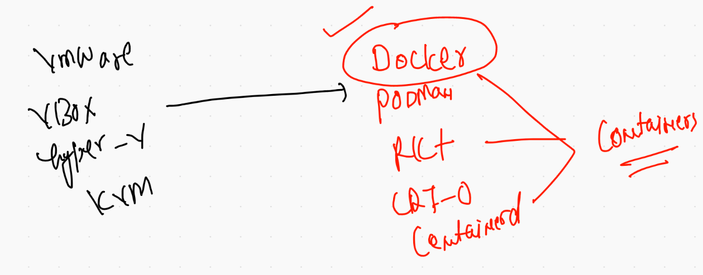
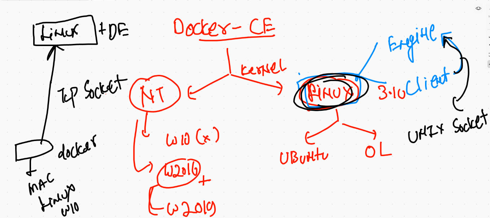
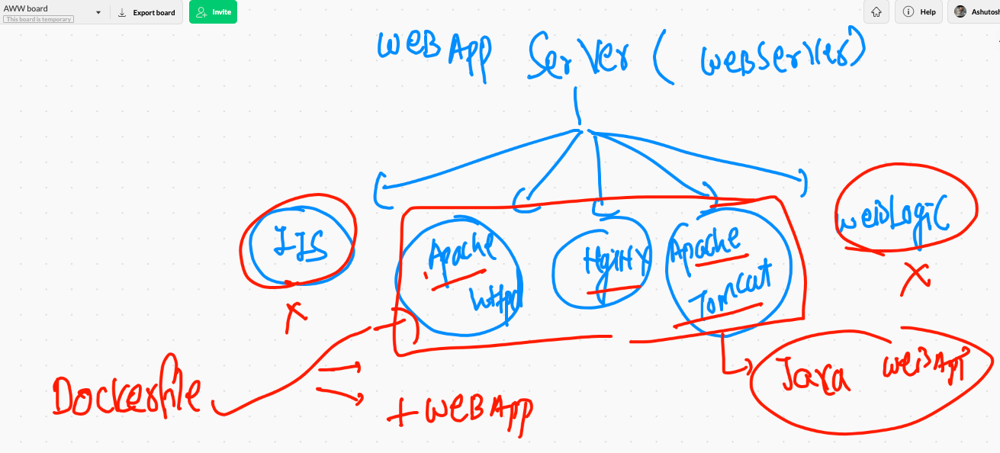
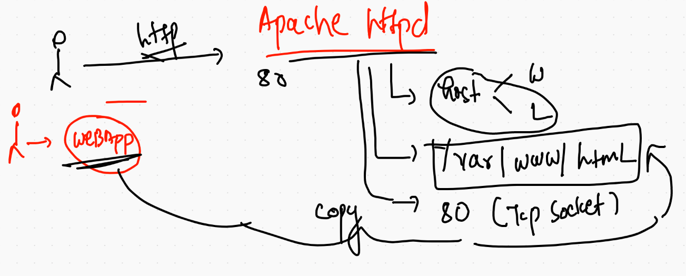
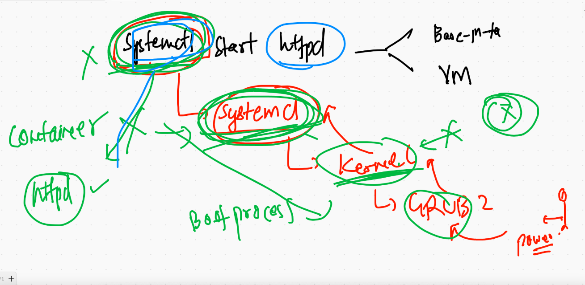
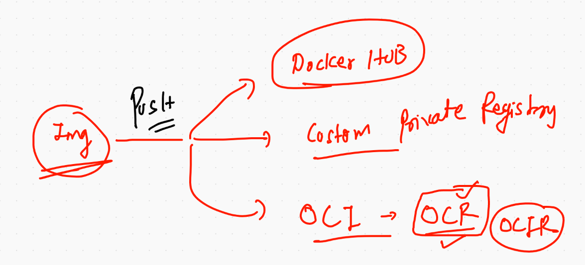

# Recap for day 1 

## CRE 



## docker engine and its few component understanding 



## Container has these many things 

```
❯ docker  run -it  --rm  alpine  sh
/ # 
/ # ls
bin    dev    etc    home   lib    media  mnt    opt    proc   root   run    sbin   srv    sys    tmp    usr    var
/ # ps  -e
PID   USER     TIME  COMMAND
    1 root      0:00 sh
    9 root      0:00 ps -e
/ # free -m 
              total        used        free      shared  buff/cache   available
Mem:           1990         387         155         367        1447        1081
Swap:          1023          55         968
/ # fdisk -l
/ # ifconfig 
eth0      Link encap:Ethernet  HWaddr 02:42:AC:11:00:02  
          inet addr:172.17.0.2  Bcast:172.17.255.255  Mask:255.255.0.0
          UP BROADCAST RUNNING MULTICAST  MTU:1500  Metric:1
          RX packets:11 errors:0 dropped:0 overruns:0 frame:0
          TX packets:0 errors:0 dropped:0 overruns:0 carrier:0
          collisions:0 txqueuelen:0 
          RX bytes:906 (906.0 B)  TX bytes:0 (0.0 B)

lo        Link encap:Local Loopback  
          inet addr:127.0.0.1  Mask:255.0.0.0
          UP LOOPBACK RUNNING  MTU:65536  Metric:1
          RX packets:0 errors:0 dropped:0 overruns:0 frame:0
          TX packets:0 errors:0 dropped:0 overruns:0 carrier:0
          collisions:0 txqueuelen:1000 
          RX bytes:0 (0.0 B)  TX bytes:0 (0.0 B)


```

## Inspecting docker image with format 

```
❯ docker  inspect  dockerashu/ashupy:v4
[
    {
        "Id": "sha256:b692df35b0e37dbb12343e8be4655e692c9ea14ad37852733bf6f04bb04bea65",
        "RepoTags": [
            "dockerashu/ashupy:v4",
            "ashupy:v4"
        ],
        "RepoDigests": [
            "dockerashu/ashupy@sha256:ae7b1f1ed9f942ccee57af2e3989f77e29f1a202f987f63a0e4ee87723e27a89"
        ],
        "Parent": "",
        "Comment": "",
        "Created": "2021-03-01T09:41:40.1241772Z",
        "Container": "084116b8507bd333fe05d363a551c1fedb901f77fec3a65933994e1ae7c23e80",
        "ContainerConfig": {

-======


❯ docker  inspect  dockerashu/ashupy:v4   -f '{{.ID}}'
sha256:b692df35b0e37dbb12343e8be4655e692c9ea14ad37852733bf6f04bb04bea65
❯ docker  inspect  dockerashu/ashupy:v4   --format='{{.ID}}'
sha256:b692df35b0e37dbb12343e8be4655e692c9ea14ad37852733bf6f04bb04bea65
❯ docker  inspect  dockerashu/ashupy:v4   --format='{{.RepoTags}}'
[dockerashu/ashupy:v4 ashupy:v4]
❯ docker  inspect  dockerashu/ashupy:v4   --format='{{.ContainerConfig.Cmd}}'
[/bin/sh -c #(nop)  ENTRYPOINT ["python3" "/code/abc.py"]]

```

## Replacing entrypoint parent process

```
 docker  run -dit --name x2  --entrypoint ping   dockerashu/ashupy:v4   127.0.0.1
a5f5076826cf626cd84d5e61cb35bbec3ddefd26e040d4f138f27b6653fd53b2
❯ docker  ps
CONTAINER ID   IMAGE                  COMMAND                  CREATED          STATUS          PORTS     NAMES
a5f5076826cf   dockerashu/ashupy:v4   "ping 127.0.0.1"         6 seconds ago    Up 4 seconds              x2
76a256de7545   dockerashu/ashupy:v4   "python3 /code/abc.p…"   38 seconds ago   Up 36 seconds             x1

```

## Web server overview 




## apache httpd 



## systemd in containerd

[systemd](https://developers.redhat.com/blog/2016/09/13/running-systemd-in-a-non-privileged-container/)

##  supervisor for multiple service in container 

[contaienr service](https://docs.docker.com/config/containers/multi-service_container/)


## systemd not supported by docker by default 




## Building htmlwebapp with apache httpd 

```

9135  docker  build  -t   htmlwebapp:v1  . 
❯ docker  images
REPOSITORY               TAG       IMAGE ID       CREATED          SIZE
htmlwebapp               v1        a921071af74b   30 seconds ago   347MB

```

## creating container from image

```
❯ docker  run  -itd --name ashuwebc1  -p  2211:80  htmlwebapp:v1
b7c7c163b88c858285af0ffa4338217e7c67470ec7fb9a72d4827bb8857cf0ad
❯ docker  ps
CONTAINER ID   IMAGE                  COMMAND                  CREATED          STATUS          PORTS                  NAMES
b7c7c163b88c   htmlwebapp:v1          "/bin/sh -c '/usr/sb…"   4 seconds ago    Up 3 seconds    0.0.0.0:2211->80/tcp   ashuwebc1

```

## checking running container content 

```
❯ docker  exec -it  ashuwebc1  bash
[root@b7c7c163b88c /]# cd  /var/www/html/
[root@b7c7c163b88c html]# ls  -a
.  ..  images  index.html  styles

```

## Image pushing to container registry 




## Pushing image to Docker hub 

```
❯ docker  tag  a921071af74b  dockerashu/htmlapp:v1
❯ docker  login  -u dockerashu
Password: 
Login Succeeded
❯ docker  push   dockerashu/htmlapp:v1
The push refers to repository [docker.io/dockerashu/htmlapp]
be4df2baf212: Pushed 
e8e9e5112d4a: Pushing [=====================================>   

```

## using docker. to start a custom private registry 

```
docker  run -itd  -v  /myimages:/var/lib/registry  -p 5000:5000 --restart always   registry 
cd468f5e6c7511d6dcc3412f7d3a32bfad8b2b4d3e14cffba7dc974d313b1a96
[root@ip-172-31-79-103 ~]# docker  ps
CONTAINER ID        IMAGE               COMMAND                  CREATED             STATUS              PORTS                    NAMES
cd468f5e6c75        registry            "/entrypoint.sh /etc…"   4 seconds ago       Up 2 seconds        0.0.0.0:5000->5000/tcp

```

## PUshing to azure container registry 

```
❯ docker   tag  alpine:latest   ashutoshh.azurecr.io/alpine:v1
❯ 
❯ 
❯ docker  login   ashutoshh.azurecr.io  -u  ashutoshh
Password: 
Login Succeeded
❯ docker  push   ashutoshh.azurecr.io/alpine:v1
The push refers to repository [ashutoshh.azurecr.io/alpine]
cb381a32b229: Pushed 
v1: digest: sha256:4661fb57f7890b9145907a1fe2555091d333ff3d28db86c3bb906f6a2be93c87 size: 528
❯ 
❯ 
❯ docker  logout   ashutoshh.azurecr.io
Removing login credentials for ashutoshh.azurecr.io


```


