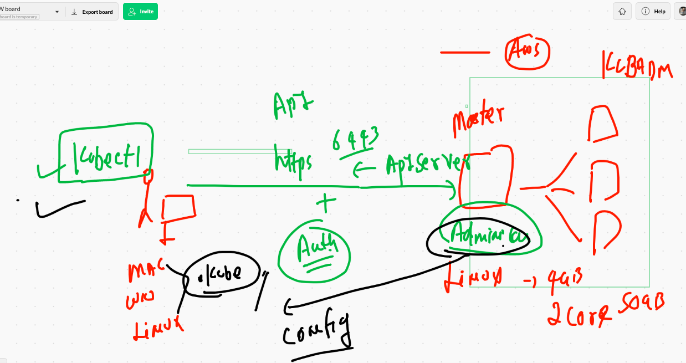
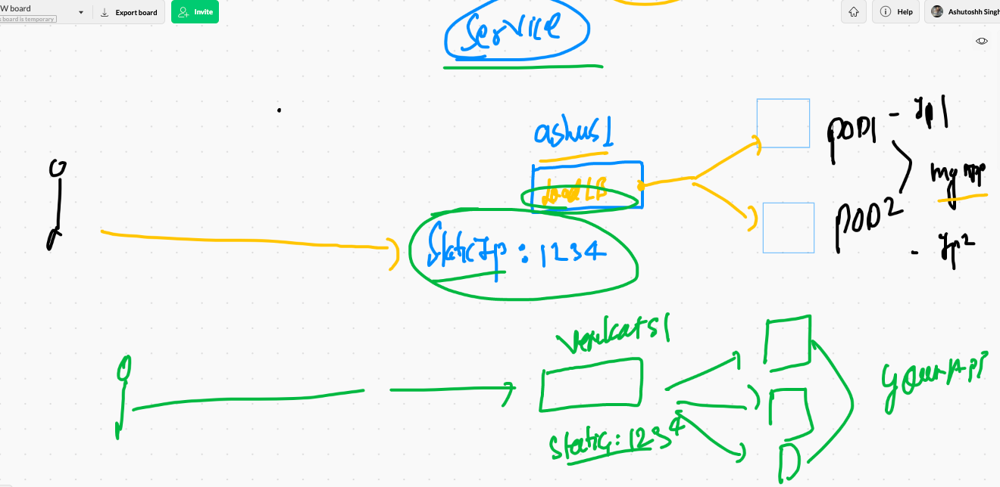
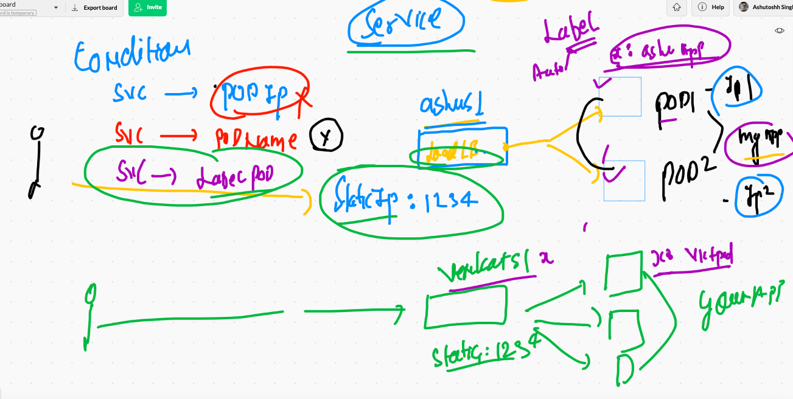

# Remote cluster connecting 

```
❯ kubectl  get  nodes --kubeconfig  admin.conf
NAME          STATUS   ROLES                  AGE   VERSION
master-node   Ready    control-plane,master   17h   v1.20.4
minion-1      Ready    <none>                 17h   v1.20.4
minion-2      Ready    <none>                 17h   v1.20.4
minion-3      Ready    <none>                 17h   v1.20.4
❯ 
❯ 
❯ kubectl  get  pods  --kubeconfig  admin.conf
No resources found in default namespace.

```

## IN mac / LInux you can set ENV variable 

```

❯ export KUBECONFIG=/Users/fire/Desktop/oracle1stmarch2021/admin.conf
❯ echo $KUBECONFIG
/Users/fire/Desktop/oracle1stmarch2021/admin.conf
❯ kubectl get  nodes
NAME          STATUS   ROLES                  AGE   VERSION
master-node   Ready    control-plane,master   17h   v1.20.4
minion-1      Ready    <none>                 17h   v1.20.4
minion-2      Ready    <none>                 17h   v1.20.4
minion-3      Ready    <none>                 17h   v1.20.4
❯ kubectl get  po
No resources found in default namespace.

```
## For windows open powershell and 

```
$env:KUBECONFIG="PATHtoadmin.conf"

```

## setting admin.conf in home directory of any OS user 



## DEploying pod 

```
❯ kubectl  get  pods -o wide
NAME         READY   STATUS    RESTARTS   AGE     IP                NODE       NOMINATED NODE   READINESS GATES
ashupod-1    1/1     Running   0          5m54s   192.168.113.3     minion-2   <none>           <none>
ashupod2     1/1     Running   0          8m10s   192.168.107.131   minion-3   <none>           <none>
av-4         1/1     Running   0          4m54s   192.168.107.132   minion-3   <none>           <none>
pod-2        1/1     Running   0          6m56s   192.168.46.195    minion-1   <none>           <none>
pravepod-1   1/1     Running   0          4m59s   192.168.113.4     minion-2   <none>           <none>
xy-1         1/1     Running   0          67s     192.168.46.196    minion-1   <none>           <none>
❯ 
❯ 
❯ kubectl  get  pods ashupod2   -o wide
NAME       READY   STATUS    RESTARTS   AGE     IP                NODE       NOMINATED NODE   READINESS GATES
ashupod2   1/1     Running   0          8m14s   192.168.107.131   minion-3   <none>           <none>


```

##  static scheduling 

```
❯ kubectl  replace -f ashupod2.yaml --force
pod "ashupod2" deleted
pod/ashupod2 replaced
❯ kubectl  get  pods ashupod2   -o wide
NAME       READY   STATUS    RESTARTS   AGE   IP               NODE       NOMINATED NODE   READINESS GATES
ashupod2   1/1     Running   0          7s    192.168.46.197   minion-1   <none>           <none>


```

## Deploying pod from Docker hub person public image

```
kubectl  run  webpod --image=dockerashu/htmlapp:v1  --port 80 --dry-run=client -o yaml >web.yaml
 kubectl  apply -f  web.yaml
pod/webpod created
```


## accessing your application locally from kubectl client machine 

```
❯ kubectl  port-forward  webpod  1234:80
Forwarding from 127.0.0.1:1234 -> 80
Forwarding from [::1]:1234 -> 80
Handling connection for 1234
Handling connection for 1234

```

## Your service can handle 



## service will use label of POD to find 



## pod with label 

```
apiVersion: v1 # kubernetes apiversion for Pod 
kind: Pod
metadata: # info about Pod 
 name: ashupod-1 # name of the Pod
 labels: # we are setting lable of my pod
  x: ashulb1 # key and value 
# this will common in multiple cases 
spec: # here info about application that has container / storage / security
 containers:
 - image: nginx # image from docker hub 
   name: ashuc1  # name of container 
   ports:
   - containerPort: 80 # application port 
 

``


