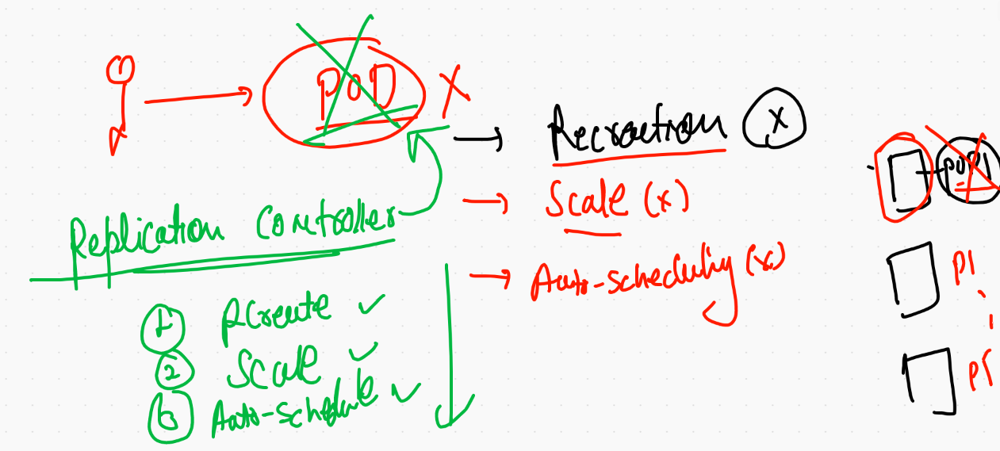

# Docker volumes 


## Creating mysql container without external storage 

```
docker  run -itd --name mydb -e MYSQL_ROOT_PASSWORD=Oracle098  mysql:5.6

❯ docker  ps
CONTAINER ID   IMAGE       COMMAND                  CREATED              STATUS              PORTS      NAMES
df03af0bed21   mysql:5.6   "docker-entrypoint.s…"   About a minute ago   Up About a minute   3306/tcp   mydb


```
## Access db container 

```
❯ docker  exec  -it  mydb bash
root@df03af0bed21:/# 

root@df03af0bed21:/# mysql -u root -pOracle098 
Warning: Using a password on the command line interface can be insecure.
Welcome to the MySQL monitor.  Commands end with ; or \g.
Your MySQL connection id is 1
Server version: 5.6.51 MySQL Community Server (GPL)

Copyright (c) 2000, 2021, Oracle and/or its affiliates. All rights reserved.

Oracle is a registered trademark of Oracle Corporation and/or its
affiliates. Other names may be trademarks of their respective
owners.

Type 'help;' or '\h' for help. Type '\c' to clear the current input statement.

mysql> 


```

### volume examples 

```
 9320  docker  run -itd --name mydb -e MYSQL_ROOT_PASSWORD=Oracle098  mysql:5.6 
 9321  docker  exec  -it  mydb bash 
 9322  docker rm  mydb -f
 9323  history
 9324  docker  volume  ls
 9325  docker  run -itd --name mydb -e MYSQL_ROOT_PASSWORD=Oracle098  -v ashuvol2:/var/lib/mysql:rw     mysql:5.6 
 9326  docker  volume  ls
 9327  docker  exec  -it  mydb bash 
 9328  docker rm  mydb -f
 9329  docker volume  ls
 9330  docker  run -itd --name mydb -e MYSQL_ROOT_PASSWORD=Oracle098  -v ashuvol2:/var/lib/mysql:rw     mysql:5.6 
 9331  docker  exec  -it  mydb bash 


```

## any Directory you can use as. volume 

```
❯ docker  run -itd --name x7 -v  /etc:/mnt/new:ro   alpine  sh
a659447cf643ac8ed290d17ea0b8845894e719eb61a2fadef6d7a2a8aae80154
❯ docker  ps
CONTAINER ID   IMAGE       COMMAND                  CREATED         STATUS         PORTS      NAMES
a659447cf643   alpine      "sh"                     4 seconds ago   Up 2 seconds              x7
9438ebdc55f0   mysql:5.6   "docker-entrypoint.s…"   7 minutes ago   Up 7 minutes   3306/tcp   mydb
❯ docker  exec -it  x7 sh
/ # cd  /mnt/new/
/mnt/new # ls
afpovertcp.cfg                         localtime                              postfix
aliases                                locate.rc                              ppp
aliases.db                             mail.rc                                profile
apache2                                man.conf                               protocols

```

## Docker volume fine


## Docker compose 


## compose file version 

[compose file version](https://docs.docker.com/compose/compose-file/)

## Compose examples 

### 1 

```
version: '3.8'
volumes: # is for creating volume
 ashuvol5: # name of volume 
services: # This is for your application in container form
 frontend: # name of app here everything is application 
  image: alpine
  container_name: ashuc123
  command: ping google.com
  
 ```
 
 ### RUnning compose file 
 
 ```
 ❯ cd  mycomposefiles
❯ ls
docker-compose.yaml hello.yaml
❯ docker-compose  -f  hello.yaml up  -d
Creating network "mycomposefiles_default" with the default driver
Creating ashuc123 ... done
❯ docker-compose ps
  Name         Command       State   Ports
------------------------------------------
ashuc123   ping google.com   Up           

```

## Example 2 

```
version: '3.8'
networks: # creating network 
 ashubr1: 
services: 
 mywebapp:
  image: mywebapp:v001 
  build: . # location of Dockerfile
  networks: # using netowrk 
   - ashubr1 
  container_name: ashuxc5 # name of container 
  ports:
   - "8899:80"

# docker build 
#  docker run 
# docker network create 
# because since file version 2 network is automatically getting created

```

## Example 3 

```
version: '3.8'
networks: # creating network 
 ashubr1: 
services: 
 mywebapp:
  image: mywebapp:v001 
  build: 
    context: .
    dockerfile: ashu.dockerfile
  networks: # using netowrk 
   - ashubr1 
  container_name: ashuxc5 # name of container 
  ports:
   - "8899:80"

# docker build 
#  docker run 
# docker network create 
# because since file version 2 network is automatically getting created

```

## Problems in Container management 


## orchestration engine 


## Reach here 

[k8sdocs](https://kubernetes.io/docs/home/)

## k8s architecture 


## componets on master node 


## mInion Node 


## cluster deployment methods 


## Minikube in one line 


## Minikube download link 


[download](https://minikube.sigs.k8s.io/docs/start/)


### kubectl version check 

```
 kubectl  version  --client
Client Version: version.Info{Major:"1", Minor:"20", GitVersion:"v1.20.2", GitCommit:"faecb196815e248d3ecfb03c680a4507229c2a56", GitTreeState:"clean", BuildDate:"2021-01-13T13:28:09Z", GoVersion:"go1.15.5", Compiler:"gc", Platform:"darwin/amd64"}

```

## checking kubernetes client & cluster version 

```
 kubectl  version
Client Version: version.Info{Major:"1", Minor:"20", GitVersion:"v1.20.2", GitCommit:"faecb196815e248d3ecfb03c680a4507229c2a56", GitTreeState:"clean", BuildDate:"2021-01-13T13:28:09Z", GoVersion:"go1.15.5", Compiler:"gc", Platform:"darwin/amd64"}
Server Version: version.Info{Major:"1", Minor:"20", GitVersion:"v1.20.2", GitCommit:"faecb196815e248d3ecfb03c680a4507229c2a56", GitTreeState:"clean", BuildDate:"2021-01-13T13:20:00Z", GoVersion:"go1.15.5", Compiler:"gc", Platform:"linux/amd64"}


````

### checking nodes 

```
❯ kubectl  cluster-info
Kubernetes control plane is running at https://127.0.0.1:55000
KubeDNS is running at https://127.0.0.1:55000/api/v1/namespaces/kube-system/services/kube-dns:dns/proxy

To further debug and diagnose cluster problems, use 'kubectl cluster-info dump'.
❯ 
❯ kubectl  get  nodes
NAME       STATUS   ROLES                  AGE   VERSION
minikube   Ready    control-plane,master   17m   v1.20.2


```

## deployment simple steps 


## Container to Pod journey 


## FInal discussion about Pod


## POds

### Example 1 

```
apiVersion: v1 # kubernetes apiversion for Pod 
kind: Pod
metadata: # info about Pod 
 name: ashupod-1 # name of the Pod
# this will common in multiple cases 
spec: # here info about application that has container / storage / security
 containers:
 - image: nginx # image from docker hub 
   name: ashuc1  # name of container 
   ports:
   - containerPort: 80 # application port 

```

## pod 

```
❯ cd  Desktop/myimages/PODS
❯ ls
ashupod1.yaml
❯ kubectl   get   pods
No resources found in default namespace.
❯ kubectl  apply -f  ashupod1.yaml
pod/ashupod-1 created
❯ 
❯ kubectl   get   pods
NAME        READY   STATUS              RESTARTS   AGE
ashupod-1   0/1     ContainerCreating   0          11s
❯ kubectl   get   pods
NAME        READY   STATUS              RESTARTS   AGE
ashupod-1   0/1     ContainerCreating   0          17s
❯ kubectl   get   pods
NAME        READY   STATUS    RESTARTS   AGE
ashupod-1   1/1     Running   0          30s

```

### describe Pod 

```
❯ kubectl   describe   pods  ashupod-1
Name:         ashupod-1
Namespace:    default
Priority:     0
Node:         minikube/192.168.49.2
Start Time:   Wed, 03 Mar 2021 15:29:10 +0530
Labels:       <none>
Annotations:  <none>
Status:       Running
IP:           172.17.0.3
IPs:
  IP:  172.17.0.3
Containers:
  ashuc1:
    Container ID:   docker://6bf931fce3289bd67206a2400e179b85a1626a2a3c1e4475ce11769caeda9c39
    Image:          nginx
    Image ID:       docker-pullable://nginx@sha256:f3693fe50d5b1df1ecd315d54813a77afd56b0245a404055a946574deb6b34fc
    Port:           80/TCP
    Host Port:      0/TCP
    State:          Running
      Started:      Wed, 03 Mar 2021 15:29:37 +0530
    Ready:          True
    Restart Count:  0

```

## to access application from  k8s client machine 

```
❯ kubectl   get   pods  -o wide
NAME        READY   STATUS    RESTARTS   AGE     IP           NODE       NOMINATED NODE   READINESS GATES
ashupod-1   1/1     Running   0          4m18s   172.17.0.3   minikube   <none>           <none>
❯ kubectl  port-forward  ashupod-1   1133:80
Forwarding from 127.0.0.1:1133 -> 80
Forwarding from [::1]:1133 -> 80
Handling connection for 1133
Handling connection for 1133

```

## auto generate YAML 

```
❯ kubectl   run  ashupod2  --image=nginx --port=80 --dry-run=client -o yaml
apiVersion: v1
kind: Pod
metadata:
  creationTimestamp: null
  labels:
    run: ashupod2
  name: ashupod2
spec:
  containers:
  - image: nginx
    name: ashupod2
    ports:
    - containerPort: 80
    resources: {}
  dnsPolicy: ClusterFirst
  restartPolicy: Always

```

## Saving output in a file 

```
kubectl   run  ashupod2  --image=nginx --port=80 --dry-run=client -o yaml >ashupod2.yaml
❯ kubectl   run  ashupod2  --image=nginx --port=80 --dry-run=client -o json  >p.json
❯ ls
ashupod1.yaml ashupod2.yaml p.json


```

## pod creating from command line 

```
9437  kubectl   run  ashupod2  --image=nginx --port=80 
 9438  kubectl  get   pods
 
```

## history 

```
9429  kubectl apply -f  ashupod2.yaml
 9430  kubectl  get  pods
 9431  kubectl delete po ashupod2
 9432  kubectl  apply -f p.json
 9433  kubectl  get  pods
 9434  kubectl delete po ashupod2
 9435  history
 9436  kubectl  get  po 
 9437  kubectl   run  ashupod2  --image=nginx --port=80 
 9438  kubectl  get   pods
 9439  history
 9440  kubectl get  po 
 9441  kubectl   exec  -it  ashupod2  -- bash 
 9442  history
 9443  kubectl  logs  -f  ashupod2
 9444  kubectl delete  pod ashupod2
 
 ```
 
 ## Pod using Replication controller [RC]
 
 
 
 ```
 9448  kubectl apply -f  helloapp.yaml 
 9449  kubectl  get  replicationcontroller
 9450  kubectl  get  po 
 9451  kubectl  get  rc
 9452  kubectl  get  po 
 9453  kubectl  get  po  ashu-rc-dtkqs -o yaml 
 9454  history
 9455  kubectl  get  all  --all
 9456  kubectl  get  all  
 9457  kubectl  get  all   --all-namespaces 
❯ 
❯ 
❯ 
❯ kubectl  get  rc
NAME      DESIRED   CURRENT   READY   AGE
ashu-rc   1         1         1       5m9s
❯ kubectl   get  po
NAME            READY   STATUS    RESTARTS   AGE
ashu-rc-dtkqs   1/1     Running   0          5m16s
❯ kubectl  delete  pod ashu-rc-dtkqs
pod "ashu-rc-dtkqs" deleted
❯ kubectl   get  po
NAME            READY   STATUS    RESTARTS   AGE
ashu-rc-dbsdb   1/1     Running   0          8s
```

## More like production / stag cases 

```
❯ minikube status
minikube
type: Control Plane
host: Running
kubelet: Running
apiserver: Running
kubeconfig: Configured
timeToStop: Nonexistent

❯ 
❯ 
❯ minikube  node add
😄  Adding node m02 to cluster minikube
❗  Cluster was created without any CNI, adding node to it might cause broken network.
E0303 16:44:04.307587   10193 register.go:139] unexpected first step: ""
👍  Starting node minikube-m02 in cluster minikube
E0303 16:44:05.009734   10193 register.go:139] unexpected first step: ""
🔥  Creating docker container (CPUs=2, Memory=2200MB) ...\ 


```

## adding  / delete node using minikube 

```
9448  kubectl apply -f  helloapp.yaml 
 9449  kubectl  get  replicationcontroller
 9450  kubectl  get  po 
 9451  kubectl  get  rc
 9452  kubectl  get  po 
 9453  kubectl  get  po  ashu-rc-dtkqs -o yaml 
 9454  history
 9455  kubectl  get  all  --all
 9456  kubectl  get  all  
 9457  kubectl  get  all   --all-namespaces 
 9458  history
 9459  kubectl  get  rc
 9460  kubectl   get  po
 9461  kubectl  delete  pod ashu-rc-dtkqs 
 9462  kubectl   get  po
 9463  history
 9464  kubectl  get  nodes
 9465  minikube status
 9466  minikube  node add
 9467  minikube status 
 9468  kubectl  get  nodes
 9469  minikube node delete 
 9470  minikube node delete  minikube-m02 
 
 ```
 
 ## 4 Node cluster 
 
 ### steps to perform in all the Nodes 
 
 ```
 #  make sure DNS & DHCP is working  
#  disable swap memory 
swapoff -a
#  install any CRE 
yum  install docker -y
systemctl start  docker 
systemclt  enable docker

# enable kernel bridge support  for CNI purpose 

modprobe br_netfilter
echo '1' > /proc/sys/net/bridge/bridge-nf-call-iptables

# configure yum / dnf server to install Kubeadm from Google repo

cat  <<EOF  >/etc/yum.repos.d/kube.repo
[kube]
baseurl=https://packages.cloud.google.com/yum/repos/kubernetes-el7-x86_64
gpgcheck=0
EOF

yum  install  kubeadm -y
systemctl start  kubelet 
systemctl enable kubelet 

```

## Choose node you want to configure as Master 

```
 kubeadm  init  --pod-network-cidr=192.168.0.0/16  --apiserver-advertise-address=0.0.0.0  --apiserver-cert-extra-sans=54.204.163.44,172.31.88.231 
[init] Using Kubernetes version: v1.20.4
[preflight] Running pre-flight checks

```

### after some time 

```

Your Kubernetes control-plane has initialized successfully!

To start using your cluster, you need to run the following as a regular user:

  mkdir -p $HOME/.kube
  sudo cp -i /etc/kubernetes/admin.conf $HOME/.kube/config
  sudo chown $(id -u):$(id -g) $HOME/.kube/config

Alternatively, if you are the root user, you can run:

  export KUBECONFIG=/etc/kubernetes/admin.conf

You should now deploy a pod network to the cluster.
Run "kubectl apply -f [podnetwork].yaml" with one of the options listed at:
  https://kubernetes.io/docs/concepts/cluster-administration/addons/

Then you can join any number of worker nodes by running the following on each as root:

kubeadm join 172.31.88.231:6443 --token 3nrupj.6g8yno05xy7xzji7 \
    --discovery-token-ca-cert-hash sha256:a5b8db6426f8a558698fc022f06ae0079874c23c1e18594ada63dffd08fee1cf 
    
  ```
  
  

